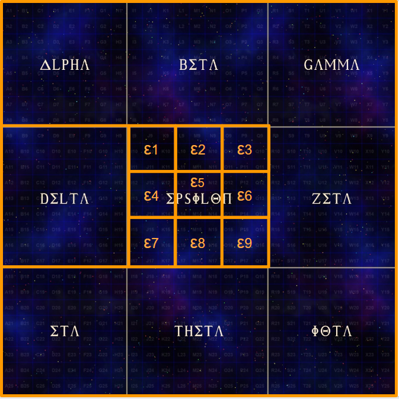
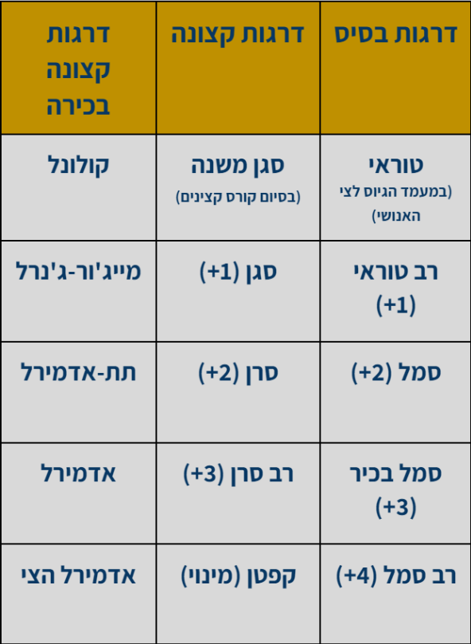
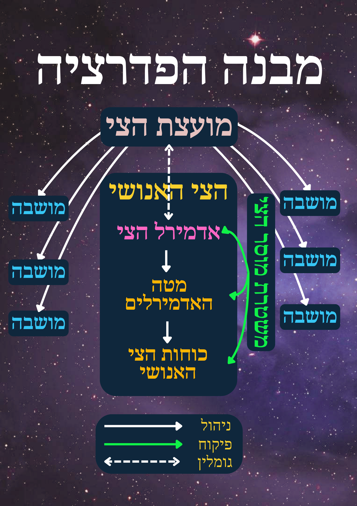

# הצי האנושי - דרגות, מספרים ותפקידים

{ align=left width="150"}

הצי האנושי מרוכז ברובו בסקטור אפסילון, וכולל כ-100,000 ספינות חלל מדגמים וסוגים שונים. לרבות מהספינות יש כטב"מים -
שמספרם הכולל בצי האנושי עולה על 1,000,000 כלי טיס בסה"כ. אדמירל הצי מפקד על כלל האנשים, הספינות, הבסיסים ותחנות החלל
הצבאיות. אדמירל הצי, מלקולם אטלס, כפוף למועצת הצי האנושי שמכתיבה את האסטרטגיה של הצי, מאשרת פעולות מסויימות,⁠⁠⁠⁠⁠⁠⁠וכו'.

תחת אדמירל הצי מכהנים אדמירלים. רובם אחראים על אזור מרחבי (סקטור, תת-סקטור וכו'), חלקם אחראית על תחום רוחב בצי -
לדוג' אדמירל טכנולוגיות, אסטרטגיה, כח-אדם. הדרגות והאחריות תחת כל אדמירל מפורטים בהמשך.

<figure markdown="span">
  { width="250" }
  <figcaption>תיאור סכמטי - חלוקת גלקסיית שביל החלב לסקטורים ולתתי-סקטורים</figcaption>
</figure>

## מבנה ותפקידים בצי האנושי

- **אדמירל הצי מלקולם אטלס - Fleet Admiral** - מפקד על כ-15,000,000 חיילים וקצינים בצי האנושי כולו. עוד על אדמירל הצי ניתן
  לקרוא [כאן](./03-fleet-admiral.md).
- **אדמירל** (כ-10,000 ספינות תחתיו סה"כ)
    - מרחבית - 11 אדמירלים, אחד לכל SubSector - תת-סקטור של סקטור אפסילון - ε1, ε2 וכו', אדמירל אחד לסקטור DELTA
      כולו, ואדמירל בראש זרוע "העומק" (Deep Space) שאחראי על הסקטורים האחרים בהם יש נוכחות מועטה יחסית של הצי
      האנושי. בסה"כ כ-10,000 ספינות תחת כל אדמירל מרחבי. פירוט על אדמירלי הצי ניתן למצוא
      [כאן](./04-admiral-staff.md#_2).
    - אדמירלים נוספים במטה על פי תחום מקצועי או תחום רוחב. פירוט על אדמירלים אלו ניתן למצוא
      [כאן](./04-admiral-staff.md#_3).
- **תת אדמירל** - מפקד על כ-10 מייג'ור-ג'נרלים (סה"כ 1,000 ספינות), אחראי על סגמנט (למשל N9, M15)
- **מייג'ור-ג'נרל** - מפקד על כ-10 קולונולים (סה\"כ 100 ספינות), יכול להיות אחראי גם על מערכת כוכבים (למשל מערכת השמש
  או מערכת לונה)
- **קולונל** - מפקד על יחידה של כ-10 ספינות, יכול להיות אחראי גם על בסיס / תחנת חלל צבאית. לכל יחידה בצי האנושי יש שם
  שמורכב משלוש אותיות, למשל יחידת PNX.
- **קפטן** - מפקד על ספינה בודדת (\"מזהה-הספינה\" Spaceship-ID של כל ספינה על פי שם היחידה, לדוג' HF-PNX-7). בכל
  ספינה צוות של בין בודדים ועד אלפים.

## דרגות בצי האנושי

{ align=left width="300" }

כל מגוייס חדש לצי האנושי מתגייס לצי בדרגת **טוראי**, ועולה בדרגות הבסיס על פי ותק עד דרגת **רב-סמל**.
ניתן להתקדם בשני מסלולים - מסלול מקצועי או מסלול פיקודי. רוב המגוייסים מתפתחים לאורך מספר שנים במסלול המקצועי
לפני מעבר למסלול פיקודי, במידה והם מתאימים. הכשרות מקצועיות וקורסי קצינים למפקדים מתקיימים ברובם בבסיס ליברטי
שבכוכב מאדים, באקדמיה של הצי האנושי.

בוגרי קורס קצינים מקבלים דרגת **סגן-משנה** בסיום הקורס, ועולים בדרגות הקצונה על פי ותק עד דרגת רב-סרן. על מנת לקבל
דרגת קפטן יש לזכות במינוי למפקד ספינה, ולא על בסיס ותק בלבד. לאחר קדנציה מוצלחת כמפקד ספינה, המתאימים ביותר יישקלו
לדרגות קצונה בכירה בצי האנושי. הקידום ייעשה על פי התאמה, תהליכי מיון מפרכים והחלטות המפקדים הבכירים בצי האנושי.

בשנים האחרונות, בעקבות המלחמה מול הברקאל, לקפטנים ניתנה החירות לגייס לשורותיהם שכירי-חרב חיצוניים. אלה מתגייסים
לצי האנושי, ועל פי כישוריהם ונסיונם מקבלים את אחת מדרגות הבסיס. טרם שירותם וגם לאורכו, ניתנת להם הזכות להכשרות
מקצועיות, וכן הזדמנות להתמיין לקורס קצינים.

## הכשרות ותפקידים

ביצוע תפקיד מקצועי מסויים מותנה בהכשרה מקצועית ייעודית (לדוג' מדע, הנדסה, טיסה). ניתן לעבור מספר הכשרות לאורך השירות
בצי, ובהתאם למלא מספר תפקידים בספינה במקביל. בפרט, תפקידי ק. אבטחה ו/או רופא הם לרוב נע"ת (נוסף-על-תפקיד)
לתפקיד אחר.

בוגר קורס קצינים בצי האנושי יכול להתמודד על תפקידי קצונה בספינה (קצין טקטי, קצין מבצעים), ואם יימצא מתאים יוכל בעתיד
להתמנות גם למפקד ספינה, לאחר שצבר לפחות 3 שנות נסיון כקצין בספינה בצי האנושי.

<table style="left: 0px">
  <tr>
    <th>הכשרות לתפקידים מקצועיים</th>
    <th>הכשרות לתפקידי פיקוד</th>
  </tr>
  <tr>
    <td></td>
    <td>מפקד/ת ספינה (Ship's Captain)</td>
  </tr>
  <tr>
    <td>טייס/ת (Pilot)</td>
    <td>קצין טקטי (Tactical Officer)</td>
  </tr>
  <tr>
    <td>טייס/י משנה (Co-Pilot)</td>
  </tr>
  <tr>
    <td>נווט/ת (Navigation)</td>
  </tr>
  <tr>
    <td>מהנדס/ת (Engineering)</td>
  </tr>
  <tr>
    <td>מדען/ית (Science)</td>
    <td>קצין מבצעים (Operations Officer)</td>
  </tr>
  <tr>
    <td>תקשורת (Comms.)</td>
  </tr>
  <tr>
    <td>קצין נשק (Weapons)</td>
  </tr>
  <tr>
    <td>סייבר (Cyber)</td>
  </tr>
  <tr>
    <td><em>*קצין אבטחה, קצין רפואה<em></td>
    <td><td/>
  </tr>
</table>

## נספח - סכמת הצי האנושי

<figure markdown="span">
  { width="400" }
  <figcaption>נספח - סכמת הצי האנושי</figcaption>
</figure>
