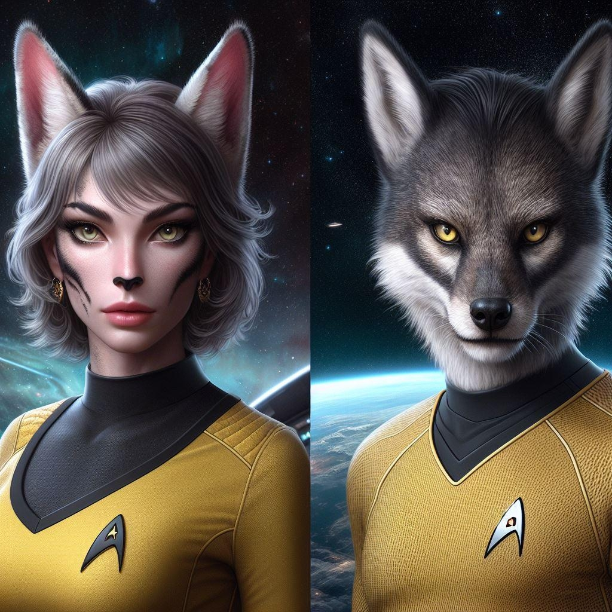

# קראס

{ align=left width="300"}

**שמות וכינויים:** קראס, מונח הלקוח מהגותו של סופר המאה ה-20 קורט וונגוט (דמות משמעותית בתרבות הקראס שהתפתחה
סביב תחילת המאה ה-28), ומשמעותו ״שבט״ או ״קהילה״.

**אוכלוסייה (בקירוב):** כ-150 אלף.

**ריכוזי אוכלוסין:** קיים ריכוז של כמה עשרות-אלפי קראס [במושבה 18](../../מושבות%20הצי/02-colony-18.md), שם
נמצאת מפקדת ״ברית הקראס״ הדואגת לזכויותיהם ונותנת מענה תרבותי, חינוכי, ורפואי.

## תיאור פיזיולוגי

הומנואידים. מדובר בפרטים אנושיים כמעט לחלוטין, למעט מודיפיקציות משתנות. מודיפיקציות אלה כוללות, בין היתר: זנבות, אוזני
חיות, עיניים חריגות, ושלל איברים לא אנושיים מעולם החי. במקרים נדירים, משולבים איברים של זנים אחרים.

## מאפיינים תרבותיים

אין מאפיינים תרבותיים רוחביים זהים לכל הקראס. רובם חברים ב-״ברית הקראס״, ארגון אזרחי שדואג לבני הזן. לעיתים מתפתחות
תתי-תרבויות בקרב קראס ששולבו עם זנים דומים. במחוז 3 במאדים, לדוגמא, פורחת בחצי המאה האחרונה קהילת אנשי-דגים, להם
מנהגים וסגנון לבוש ייחודי.

## רקע להיווצרותם

בניגוד לאנדרואידים או לניאו-ספייאנס, הקראס לא יוצרו מעולם באופן רשמי או בשיתוף פעולה עם הצי, וגם לא במקום מרכזי אחד.
מדובר בפליטי ניסויים בלתי-חוקיים ולקוחות של ניתוחים פלסטי-גנטיים קיצוניים. כמעט שליש מהם הינם צאצאים של קורבנות
כת ״הכימרה״ שפעלה [במושבת השמיים בלונה](../../מושבות%20הצי/08-former-colonies.md#_1) בין השנים 2620-2689, שדרשה ממאמיניה
לשלב את הגנים שלהם עם גנים של זנים אחרים כדי לקרב את אחרית הימים.

## תכונות גנטיות ייחודיות

מלבד האלמנטים הפיזיולוגיים הנראים לעין והיחודיים לקראס השונים, לרוב קיימים גם שינויים גנטיים. דוגמאות לשינויים כאלה:
שינוי גוון עור לפי שינויים בלחץ הדם, ראיית גלי אור שמעבר לספקטרום הנצפה ע״י העין האנושית, יכולת עיכול של דשא, ועוד.
שינויים אלה משפיעים לעיתים קרובות גם על אופיים של הקראס, שהתנהגותם ודפוסי הפעילות שלהם מזכירים לעיתים את אלה של
הזנים איתם שולבו. השינויים יכולים לעבור לפעמים לדור ההמשך, בין אם שני ההורים הם קראס או רק אחד.

## קשר לצי האנושי

רבים מהקראס משרתים בצי האנושי. אף על פי שקיימות כנגדם לפעמים דעות קדומות, ״ברית הקראס״ מעורבת בשלומם של הקראס
ומטפלת, בשיתוף פעולה עם הצי, באפליה כנגדם.
