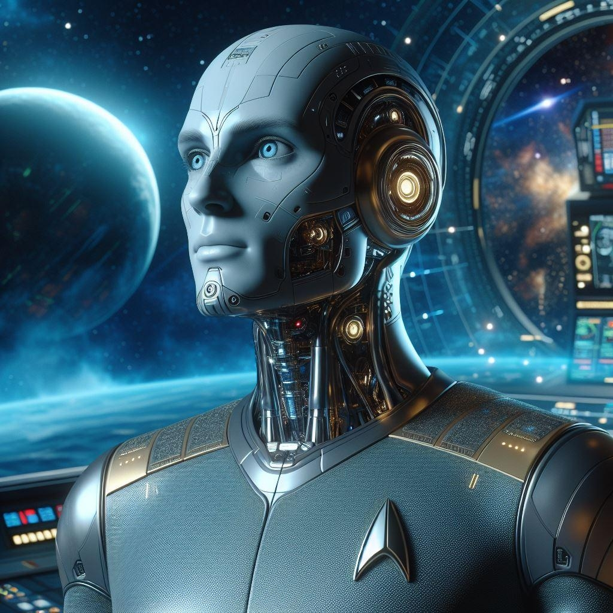

# אנדרואידים (H.MTX)

{ align=left width="300"}

**שמות וכינויים:** H.MTX - Humanoid Multifunctional Technological Xeno. MTX'S (אמ.טי.אקסים), דרואידים דור A. במהלך ההיסטוריה הופנו
כלפיהם כינויי גנאי רבים כגון: "בוטים", "מוח-מתכת", "זן-משרתים" ו-"חלקי חילוף".

**אוכלוסייה (בקירוב):** 30,000

**ריכוזי אוכלוסין:** אין

## תיאור פיזיולוגי

אנדרואידים מהדור הישן שנוצרו למטרות שירות בספינות תובלה וביצוע מטלות לוגיסטיות ומבצעיות פשוטות כחיילים מן המניין בצי. בעלי חזות
הומנואידית במבנה הגוף והפנים, אך עם סימני היכר ברורים לכך שמדובר ברובוטים: חריצים, שבבים, וברגים בולטים לעין. לאור הזמן הרב שעבר
מאז ייצורם, רבים מהם איבדו את המהימנות אשר האנושות יחסה להם בעבר.כמו-כן, הליכתם, קולם, והבעות הפנים שלהם מסגירות בקלות את
היותם זן מכאני.

## רקע להיווצרותם

יום אחד בשנת 2258 במעבדת מארס-טק המרכזית [שבמאדים](../../מושבות%20הצי/01-mars.md), הגיעו לשיאם מאות שנים של פיתוחים טכנולוגיים,
ששילבו הנדסה מתקדמת ובינה מלאכותית, לכדי דבר שיכול היה סוף סוף להיקרא: זן תבונתי מלאכותי. ה-H.MTX הראשון הושק לאוויר העולם.

תחת הכותרת MTX התחלפו דגמים רבים של אנדרואידים, שכיום נחשבים בני הדור ה״ישן״ (לעומת אחיהם הצעירים, ה-H.Z). הם פותחו לאורך
השנים 2258-2670 ע"י חברת מארס-טק ושלוחותיה. כל גרסה חדשה החליפה את קודמתה, וכללה יכולות מוטוריות, אנליטיות, ותקשורתיות
משודרגות. עד ראשית המאה ה-25, האנדרואידים נטמעו בצי באופן מלא - כחיילים ואף מפקדים יקרי-ערך, וכגשר בין בני האדם לזנים האחרים.

לצד הברכה הגדולה שהביא עימו הזן החדש, רבים באנושות התקשו להכיל את הכללתם כחלק מכוח העבודה, ובהמשך גם כחלק מהחברה.
מאות אלפי מקרי אלימות נרשמו בתחנות המשטרה של מושבות הצי כלפי אנדרואידים. הם הוגדרו ע"י דוקטור יוג׳ין פרסקו, ראש המטה למאבק
ברצח זנים, בשנת 2756 כ"זן שחשף את יצר האדם על צורתו האפלה ביותר שנראתה אי פעם, אך עם זאת, הזן ששינה את האנושות את השינוי
הדרמטי ביותר שעברה מאז ומתמיד".

בשנת 2670 החליף דגם ה-H.Z המשודרג את ייצור ה-H.MTX. מאז הייצור שלהם הופסק, ועם השנים גם תחזוקה של הדגם הפכה לכמעט בלתי
אפשרית. כיום לא ניתן למצוא עוד רבים במצב תקין.

## תכונות ייחודיות

???

## קשר לצי האנושי

על פי מסמך העדכון השנתי של אדמירל השלישות לשנת 2799, משרתים בצי האנושי כ-3,000 אנדרואידים מסוג H.MTX. מדובר
באנדרואידים שברוב המקרים משרתים בצי כבר שנים רבות (לפחות מאה וחצי), או באנדרואידים שהורכבו בשוק השחור מחלקי חילוף (שכן ייצור
אנדרואידים חדשים אסור בפדרציה). הם מתקבלים, כשאר הזנים, בזרועות פתוחות בצי.
