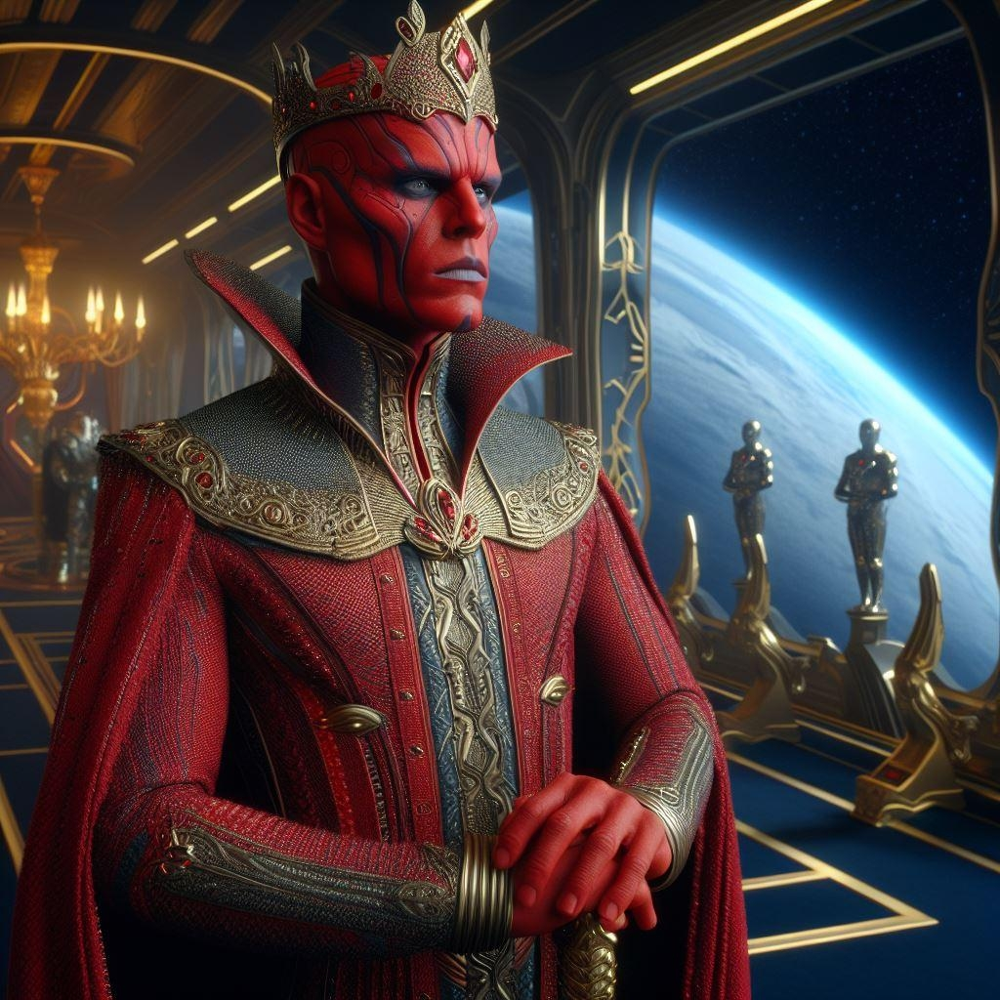

# ברקאל

!!! info "פרשנויות"

    זהו דף המדבר על הזן החוצני הקרוי *ברקאל*. אם ברצונכם לקרוא מידע על הפלג הרלוונטי, ראו גם את הדף על
    [קיסרות הברקאל](../../פלגים/04-brakkal-empire.md).

{ align=left width="300"}

**שמות וכינויים:** ברקאל (Brakaal)

**כוכב מקור:** כוכב ברקאל

**אוכלוסייה (בקירוב):** כמות מאות פריטים בודדים בסקטור דלתא. הזן הובס במלחמת הברקאל ה-3. נכון לשנת 2799, היו כ-3⁠⁠⁠⁠⁠⁠⁠מיליארד ברקאל.

**ריכוזי אוכלוסין:** אין.

**שנת מפגש עם האנושות:** 2730

## תיאור פיזיולוגי

הומנואידים בעלי אור אדמדמם-ארגמני. הברקאל נוהגים להתקעקע בדיו שחור על פניהם.

## מאפיינים תרבותיים

לא ידוע רבות על תרבותם של הברקאל. מדובר בזן החוצני היחיד המוכר לאנושות שלא התערה בקרב הזנים האחרים, ולא כרת עימם בריתות.
מלבד סגנון הלבוש והכתב הברקאל שהוא כתב מראה שנכתב עם שתי הידיים, ידוע מעט. עוד על הקיסרות הברקאלית בפרק הרלוונטי בהמשך.

## מתן שמות

אין לנו ידע וודאי על דפוסי מתן השמות בקרב הברקאל.

## קשר לצי האנושי

מרגע המפגש הראשון הברקאל היו עוינים את הפדרציה של הצי האנושי בכלל ואת האנושות בפרט. שלוש מלחמות ברקאל הובילו להשמדתם.

## תכונות גנטיות ייחודיות

לא ידוע על תכונות גנטיות ייחודיות לברקאל. ייתכן ובידי הצי קיים ידע כזה, אך הוא לא שותף עם כותב שורות אלה.
