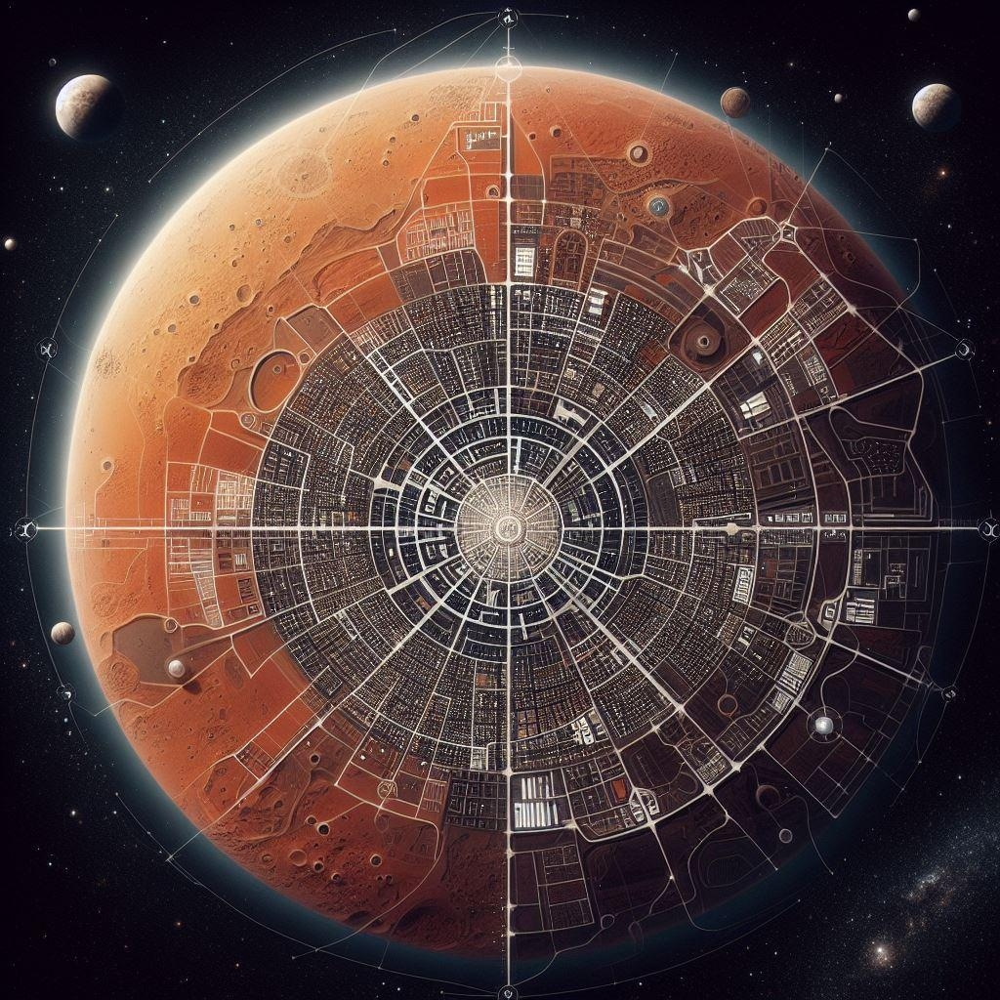

# מושבת מאדים

{ align=left width="300" }

## מאדים - המושבה המתוכננת הראשונה

קשה יהיה לתאר את המושבה הוותיקה בצי - כמעט 700 שנות היסטוריה, תרבות, פוליטיקה, מדע, ומסחר, עם 2 מיליארד תושבים חוצנים
ואנושיים. שקלתי להקדיש פרק שלם רק לניואנסים הקולינריים של ההמבורגרים במחוזות המושבה השונים, אבל הזמן קצר והדד-ליין
מתקתק. אסתפק במשפט אזהרה קצר: אף פעם אל תבקשו ״עוד מיונז״ במאדים.

מושבת מאדים הוקמה בשנת 2125. בשונה [ממושבת לונאר](./08-former-colonies.md#_2) שהתחילה כמרכז מחקר לאחר המפגש
עם [הארלניאנים](../פלגים/05-independent-entities.md#_2) והלכה ונבנתה סביבו, מושבת מאדים הוקמה בכוונה
לקלוט כמויות מאסיביות של מהגרים. השרטוטים המקוריים של מתכנן המושבה **מומו נאגו** (Momo Nagoo) משנת 2080, תיארו
היערכות להגעת מאות אלפי בני אדם למאדים. אז, איש לא דמיין שיחיו על מאדים קרוב ל-2 מיליארד בני אדם וזנים אחרים.

אך [מתקפת הטרור של ״טרה נוסטרה״](../היסטוריה/01-early-space-age.md#_5) והצורך הדחוף בפינוי
מיליוני השורדים דחפה להרחבת התוכניות. ״שיטת ההתפרסות״ שהייתה הבסיס לתכנונו המקורי של נאגו, התגלתה כמודל שניתן להכפיל
בעשרות מונים: רכבות השינוע, תעלות הביוב, וצינורות מערכות החיים תוכננו מראש כך שיוכלו להתרחב כמעט ללא הגבלה. נכון
לכתיבת שורות אלה, שטחה של מושבת מאדים עומד על כמעט 10 מיליון קמ״ר, בערך כגודלה של ארה״ב בתחילת המאה ה-21 (לחובבי
הפרה-היסטוריה מבין הקוראים).

כאשר הוקמה פדרצית הצי האנושי בשנת 2222, הייתה המושבה לבירתה המובנת מאליה. משרדי ניהול ההתיישבות האנושית בחלל הפכו
לקריית הפדרציה, שם ניתן למצוא עד היום את בנייני [מועצת הצי](../הצי%20האנושי/02-fleet-council.md),
[מטה האדמירלים](../הצי%20האנושי/04-admiral-staff.md), ומגדל [האדמירל](../הצי%20האנושי/03-fleet-admiral.md).

לאורך מאות שנות ההתיישבות האנושית בחלל, שמרה מאדים על מעמדה כמושבה חלוצה ומובילה, שהשפעתה מורגשת בכל קצוות הפדרציה.
יעידו על כך שלושת נציגה במועצת הצי, המספר הגבוה ביותר של נציגים שיש למושבה.

## מחוזות מאדים

מראשית דרכה של המושבה ידעו מתכנניה האזרחיים והמנהליים שלא תוכל להתקיים כיחידה אחת לאורך זמן עם גדילתה. לכן, מראש חולקה
מאדים לשישה מחוזות, שכל אחד מהם מתנהג כמדינה קטנה עם אוטונומיה שלטונית (בתוך האוטונומיה הקיימת של מושבת מאדים כחלק
מהפדרציה)

למי שהלך לאיבוד בתיאור, הינה לכם מטאפורה: מושבת מאדים היא כמו פיצה עם שש חתיכות, כאשר החלק הקשה של הפיצה (ולעניות
דעתי, החלק הכי פחות מוערך במאכל הפופולרי), הולך ומתרחק כלפי חוץ ככל שהעיר מתרחבת. במרכז הפיצה (איפה שלעיתים מונח שולחן
הפלסטיק המיניאטורי) - קריית הפדרציה.

ואלה המשולשים:

* **מחוז 1** - המחוז הגדול ביותר ובעל האוכלוסייה הגדולה ביותר - כמעט מחצית מתושבי הכוכב מתגוררים בו.
* **מחוז 2** - ידוע גם כ"מחוז המדע", מחוז בינוני-קטן בגודלו. היווה לאורך השנים קרקע פורייה לניסויים ולחקר. במחוז זה ניתן למצוא את
  אוניברסיטת מאדים ואת מתחמי הענק של חברת מארס-טק.
* **מחוז 3** - המחוז השני בגודלו. בשטחו נמצאים מאגרי מים ענקיים, ולכן פרחה בו תעשיית מכרות המים.
* **מחוז 4** - מחוז בינוני בגודלו. כשני-שליש ממפעלי ייצור הנשק של הצי נמצאים במחוז זה.
* **מחוז 5** - המחוז השלישי בגודלו. נקודת הציון המשמעותית ביותר בו - בסיס ליברטי, בסיס הכשרת הטירונים והבסיס הפלנטרי הגדול
  ביותר של הצי האנושי.
* **מחוז 6** - המחוז הקטן ביותר בשטחו ובאוכלוסייתו, בו מתגוררים קצת יותר ממיליון אנשים. נחשב למחוז העשיר ביותר בכוכב.
  מתגוררים בו קצינים ופוליטיקאים רבים מרחבי הצי.

## הפוליטיקה של מאדים

בשיטת התכנון המקורית של המושבה, החליטו מתכנניה לאפשר חופש פוליטי נרחב לכל מחוז, יחד עם עיגון הזכות לעבור בין מחוזות ללא
בירוקרטיה. בזכות המוביליות, כך חשבו, יוכלו המתיישבים להצביע ברגליהם, ובשוק החופשי של הרעיונות יצטרכו השיטות הפוליטיות
לשכלל את עצמן.

אך הנטייה לקיבעון הוא טבעה של האנושות: שיטות המשטר, שאכן עברו שינויים וניסויים רבים בעשורים הראשונים לקיום המושבה, קפאו
על שמריהם. גם היכולת לעבור בין המחוזות הוגבלה לאורך הזמן בעקבות אינטרסים שונים. כך נותרנו עם קליפת החזון: שיטות משטר מגוונות,
ויש לומר, אפילו יצירתיות, אך ללא הגמישות המתמדת.

לא נאריך כאן בכל שיטה, מעלותיה ומגבלותיה (לשם כך אמליץ להוריד למחשבים עותק של ספרה המבריק של עמיתתי לידה ווז׳ניאק,
״פוליטיקאים ממאדים״) אך אפשר להסתפק ולומר שהשיטות אכן מגוונות. במחוז 1 לדוגמא, בוחרים בבחירות הכלליות את שר המחוז, שממנה
מועצה מקצועית שמנהלת את המחוז. במחוז 4, עשרים-ושלושת גילדות הייצור הגדולות (שמעסיקות 90% מהמבוגרים מעל גיל 18) ממנות כל
אחת נציג לדירקטוריון המחוז, שם מתקיימות הבחירות לדירקטור.

מעל כל המחוזות ניצב שלטון מרכזי אחד - ממשלת מאדים. הבחירות לממשלה מתקיימות אחת לעשר שנים, יחד עם הבחירות למועצת הצי.
הבחירות הן בחירות מפלגתיות. ראש המפלגה שמקבל את כמות הקולות הגדולה ביותר הופך לראש ממשלת מאדים ולנציג במועצה. הוא מרכיב
קואליציה וממנה שני סגנים ממפלגות אחרות, ושניהם הופכים לשני הנציגים הנוספים של מושבת מאדים במועצת הצי (סה״כ שלושה נציגים).

בשני העשורים האחרונים שולטת במאדים מפלגת ״אחדות הזנים״ בראשותו של ז׳אן מולינגי, בן אנוש שאומץ ע״י משפחת מהגרים אקווארית.
המפלגה עלתה לשלטון כתגובה פוליטית לפילוג האנושי.
