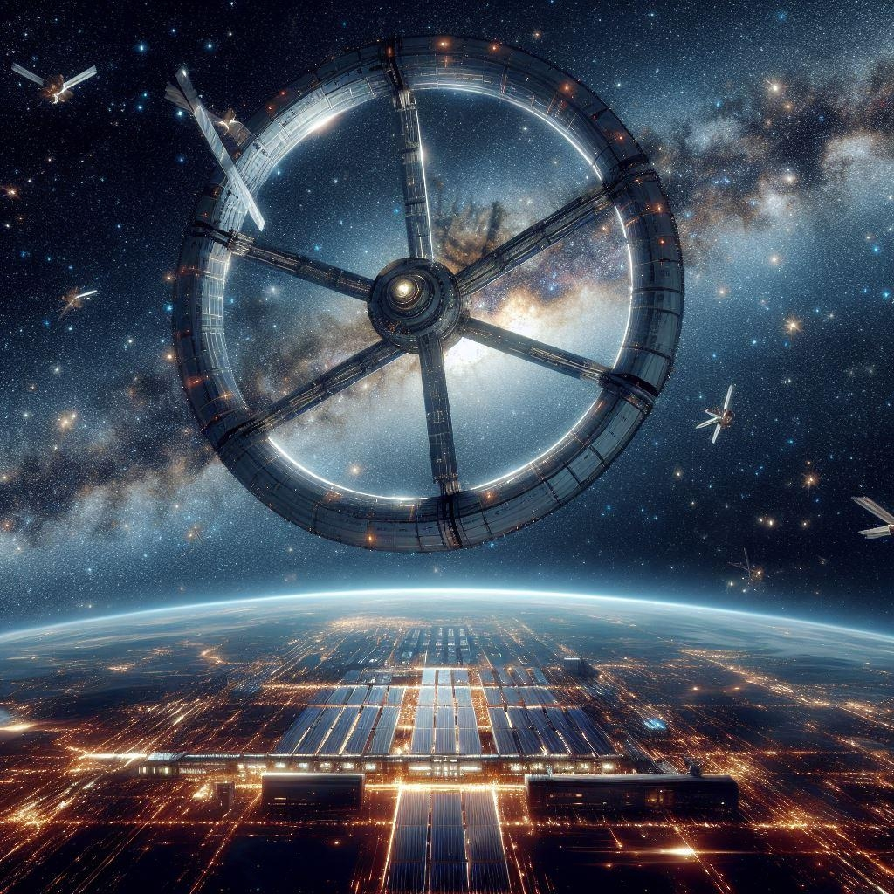

# מושבה 18

{ align=left width="300" }

## הפרויקט הטכנולוגי השאפתני בשביל החלב

היכן שלא תלכו ברחבי הפדרציה, מושבה 18 היא סמל. סמל לשגשוג כלכלי, שמאפיין את מרבית תושביו. סמל לשיתוף הפעולה בין
[הקודומא](../זנים/קסנו-ויטה/01-kodoma.md) לבני האדם שבנו אותו יחד. סמל של הישג טכנולוגי מרשים, ויש שיגידו, כמעט
אלוהי, במימדיו.

בניית המושבה החלה שנים ספורות לאחר הביקור האנושי הראשון [בכוכב קודומא](../מושבות%20הצי/06-sha-den-bach.md). המשלחות
הדיפלומטיות של שני הצדדים, שחלקו ביניהן בין היתר ידע טכנולוגי, גילו
[שהארלניאנים](../פלגים/05-independent-entities.md#_1) חלקו עם שני הזנים טכנולוגיות לא-זהות.
בזהירות ובחשאיות תחילה, שיתפו משלחות מדעיות אנושיות את הקודומא בטכנולוגיית מנוע-הקיפול. בתמורה, חשפו הקודומא
חלק משמעותי מהטכנולוגיה הארלניאנית אליה הם נחשפו: **מחוללי כבידה.**

האלכימיה הפיזיקלית שהתחוללה במעבדות המשלחות המשותפות הולידה רעיון שנשמע בלתי-אפשרי: כוכב מלאכותי בצורת טבעת.

העבודה יצאה לדרך בשנת 2217. חוקרים רבים, ועבדכם הנאמן ביניהם, סבורים כי הנהגת הצי לא חשבה שהבנייה תסתיים בהצלחה
כשתמכה בו, וכי שיתוף הפעולה האנושי לבניית המושבה נועד במקור רק כדי לרכך את הקודומא לקראת חתימה על הקמת הפדרציה
(לשם השקיפות האקדמית, חשוב לציין שחולק עליי בנושא הזה החוקר וולטר ואן-דר-שטרוך, שטוען שהיו אלה דווקא הקודומא שניצלו
את המשאבים של הצי. לשם השקיפות האקדמית, חשוב גם לציין שואן-דר-שטרוך הוא אימבציל חסר כל הבנה היסטורית או עמוד שדרה
מקצועי, שעדיין מלמד באוניברסיטה רק בגלל שיש לו קביעות ואי אפשר לפטר אותו.)

בשנת 2301 נחנכה בטקס חגיגי מושבה 18, הכוכב המלאכותי הראשון. לקחו 83 שנים לבנות את הפלא הזה. קוטרה של המושבה 3,500
קילומטרים - מעט יותר מקוטרה של לונה. כיום, התחנה מכילה את הריכוז האנושי הגדול ביותר שלא בכוכב לכת או ירח.

## מודל לדו-קיום בין הזנים

חנוכתה של מושבה 18 בישרה על עידן חדש בתולדות הצי האנושי: לראשונה, מושבה שמהיום בו נהגה הרעיון לכוננה ובכל תהליך הקמתה
הכילה תערבות של בני-אנוש וזנים חוצניים. סמל המושבה שמבטא את היסוד הזה הוא שתי ידיים משולבות סביב לפיד: יד אנושית ויד
קודומאית.

הניסיון האנושי מהאיבה הגדולה שהתקיימה בין פלגי האנושות השונים לאורך ההיסטוריה האנושית, הובילו את מייסדי מושבה 18 לכונן
מסמך המכונה **״קודקס הזנים״** שנה לאחר הקמת פדרצית הצי האנושי. עשרות משפטנים ואנשי רוח מקרב בני האדם והקודומא, ניסחו
מסמך מקיף שקורא לשותפות בין הזנים בחלל ולחקיקת חוקים ברורים הנלחמים בקסנופוביה, וכן, מעגן זכויות טבעיות של כל זן שהצי
יפגוש בו בעתיד. קודקס הזנים אומץ במהרה בשאר המושבות של הצי כמסמך יסוד ערכי ומחייב משפטית. עד היום, חיילי הצי נשבעים
בטקס סיום ההכשרה שלהם כאשר ידם על הקודקס.

הקודקס השפיע גם על שיטת הממשל של המושבה הצעירה. עם איכלוס המושבה, הוקם ״קונגרס מושבה 18״, הגוף המנהל של המועצה
שנבחר כל שלוש שנים וכולל בתוכו מאה חברים, כאשר החוק מחייב ייצוג הולם על פי אחוזי הזנים במושבה. בראש הוועדה עומדים שני
נגידים, האחד בן-אנוש והשני מזן חוצני. בכל חצי שנה מחליפים ביניהם השניים את ניהול המושבה: הנגיד הראשי הופך לנגיד המשני.

יש שיגידו שהגישה של מושבה 18, שדוגלת בשוויון מוחלט בייצוג לבני אדם וזנים, מייצרת שוויון מלאכותי ומגבירה את האיבה בין הזנים
יותר מאשר מחברת ביניהם. אחרים יטענו שזו הדרך היחידה לייצר יציבות לאורך זמן במושבה שהושתתה על העקרון הרעוע ממילא של
שוויון בין-זני. הפעם לכותב שורות אלה אין הערה עוקצנית עבור הקורא הציני. ישנן סוגיות שבהן צריך פשוט לפקוח את העיניים, האוזניים
והמחושים, ולהבין לבד.

## מרכז הכלכלה והתרבות של הצי

עם השנים, הפכה מושבה 18 למרכז כלכלי ותרבותי שהשפעתו ברחבי הצי אינה-ניתנת לערעור. הקלישאה בת ארבע-מאות השנים של
הצעיר שמגיע למושבה 18 בלי כלום ומסיים את חייו עשיר כקורח מוכרת לכל בר-דעת בצי.

אם נסתכל על זה באופן סטטיסטי, יש בקלישאה לא מעט מן האמת: 92% מתושבי המושבה משתכרים מעל ממוצע הצי. מרבית חברות
הטכנולוגיה, הפיתוח, והמחקר, מבססות את מפקדותיהם במושבה 18, ומעסיקות עשרות-אלפים במשרדים, במעבדות, ובניהול הרובוטים
והמכשירים המתוחכמים. טייקונים רבים, כדוגמת מנכ״ל הקונגלומרט השמימי אבאזו ניראר ואדמירלית הצי לשעבר גאורגיה קוך מנהלים
את האימפריות הכלכליות שלהם משם.

אקלים הצמיחה וההשקעה הכלכלית האדירה במושבה לאורך המאות הביאו עימם גם פריחה תרבותית. במושבה צמחו מוסדות תרבותיים
ששמם הולך לפניהם בכל רחבי הגלקסיה המוכרת, וביניהם: תיאטרון מושבה 18, סטודיו סרטי המציאות המדומה ״אטואל-נואר״, והקרקס
הנודד של ז׳ילברטו מיאמוטו.

## משבר פליטי הפלאקור

בתוך אלפי הדפים של ההיסטוריה, לא ניתן להלאות את מי ששומע את הסיפור בכל פרט קטן ונקודתי במשך שעות ארוכות (לידיעת הקוראת
העונה לשם אמא שלי, שתזכה לימים ארוכים ושקטים). נקודות שבר ורתיחה באות והולכות, והן רבות מספור. אך בכל זאת החלטנו להתייחס
כאן למשבר עכשווי, בתוך היסטוריה ארוכת-השנים של המושבה: משבר פליטי [הפלאקור (Falakor)](../זנים/קסנו-ויטה/03-falkor.md).

לפני שנתיים, נכבתה בתהליך מואץ, כמעט בפתאומיות, [שמשם של הפלאקור](./08-former-colonies.md#כוכב-פלאקור), ובני האומה המשגשגת
ניצבו בפני סכנה קיומית. מיליונים רבים מתו ואחרים נהפכו במונחים גלקטיים ״בין-לילה״ לפליטים. חלק גדול מאותם הפליטים -
כמעט 100 מיליון - מצאו את עצמם מתדפקים על שערי מושבה 18. (עוד על הפלאקור ועל מערכת הכוכבים שלהם שאבדה תוכלו לקרוא בפרק
על הפלאקור ובפרק על כוכבם).

מושבה 18, שתמיד חרטה על דגלה את הדאגה לכלל הזנים, כינסה מועצת חירום של הקונגרס, וברוב קולות החליטה להקים כוח מבצעי
לקליטת הפלאקור. המושבה קלטה אותם, חשוב לציין, בהצלחה די גדולה - 98% מהפלאקור הבוגרים שנקלטו במושבה מצאו בה תעסוקה,
כמחציתם במקצועות בהם עבדו לפני כן.

אך לאורך ההיסטוריה האנושית, אף קליטה מסיבית של פליטים לא חלפה בשקט. רבים מתושבי המושבה יספרו לכם שבשנתיים שחלפו
מאז, האיזון העדין שנשמר במושבה בין הזנים הופר, ומקרים קסנופוביים עלו בעשרות אחוזים. דמותה של המושבה, שהייתה יציבה כל כך
במאות שנות קיומה, ניצבת במבחן.
