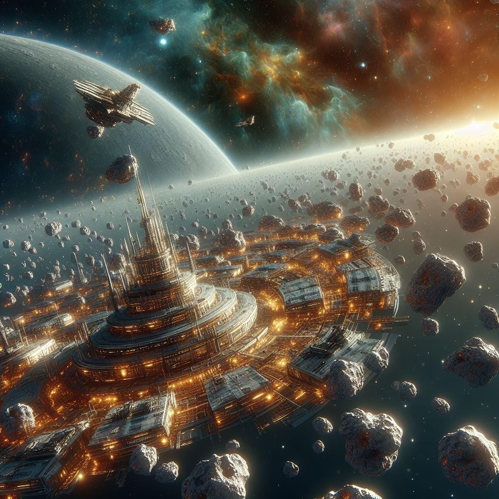

# הפרסה

{ align=left width="300" }

## קרן שפע בקצה הסקטור

בסוף המאה ה-23 ובתחילת המאה ה-24, שלח הצי האנושי ספינות סיור לכל קצוות הסקטור כדי להרחיב את גבולות המפה המוכרות.
לאורך השנים נמצאו מצבורי מינרלים פזורים סביב כוכבים שגוועו ובכוכבי לכת רבים, והצי הציב סביבם תחנות חלל בודדות לכרייה נקודתית.

ביום בהיר אחד בשנת 2328 קפץ קצין זוטר בצי לעוד אחת מהנקודות הרבות הללו בתת-סקטור אפסילון 7, וגילה להפתעתו דבר מדהים:
החללית שלו הייתה מוקפת מכל עבר בצבירים אדירים של מתכות ומינרלים. אומרים שמדען החללית התעלף ולא התעורר במשך כמה ימים
כשראה את תוצאות הסריקה.

תחנה ראשונה של הצי הוקמה באותו מקום כעבור כמה שבועות, וזכתה לשם ״קורנוקופיה 1״ - קרן השפע. התחנה הוקמה בשיתוף עם זכיין
שזכה במכרז על כריית המשאבים - טייקון טרי בשם טולגאר ניראר. חברתו ״ניראר מינרלים״ הפכה בן-ליל לאחת החברות המשפיעות
בגלקסיה, וכעבור כמה מאות הפכה [לקונגלומרט השמימי](../פלגים/02-celestial-congolomerate.md) (פרטים נוספים על הקונגלומרט
בפרק בהמשך).

תחנות זהות במודל תחנת ״קורנוקופיה 1״ המשיכה להתפרס הלאה אל קצוות תת-הסקטור, ואז עוד מעבר לכך אל תתי-סקטור 4 ו-8. צורת
ההתפשטות זיכתה את מערכת התחנות, שבהמשך הוכרזה כמושבה עם נציג [במועצת הצי](../הצי%20האנושי/02-fleet-council.md),
בשם ״הפרסה״.

לאורך שנות ההתפרסות של המושבה, היא הפכה מוקד משיכה לבני אדם ולבני זנים אחרים מרחבי הצי, כאשר החלו לנהור אליה
[אקוואריים](../זנים/קסנו-ויטה/02-aquari.md), [בני כוכב פלאקור](../זנים/קסנו-ויטה/03-falkor.md), וגם
[קודומא](../זנים/קסנו-ויטה/01-kodoma.md). הפרסה הצליחה אף לפרוץ את גבולות הצי, ולמשוך אליה מהגרים מזן הלודו -
שלא נוטים עד היום להשתלב בשאר מושבות הצי.

## מושבה מרושתת ומאוגדת

מושבת הפרסה משתרעת על פני שלושה תתי-סקטור - 4, 7, ו-8. מדובר בשטח אדיר-מימדים. מקצה האחד של הפרסה לקצה השני הרחוק
ביותר יש יותר מ-21 אלף שנות אור. כל שינוע סחורה, פסגה פוליטית, ותחבורה בין תחנות, דורשת שימוש במנוע קיפול, ותיאומים רבים. מצד
אחד, מדובר במכשול גדול לניהול מושבה. מצד שני - תירוץ טוב לא לבקר את חמותי בקורנוקופיה 7.

על מלאכת התיאום המורכבת הזו מופקד ה״יוניון״, איגוד עובדי הפרסה ששולט באזור מאז שביתת כורי הפלטינה של השנים 2482-2488,
השביתה שעצרה כמעט לחלוטין את ייצור ספינות הצי והובילה להכנסת נציג הפרסה למועצת הצי. בראש היוניון עומד הכורה הראשי, נשיא
האיגוד. הוא לא משמש גם כנציג במועצת הצי - תפקיד זה שמור, מאינטרסים פוליטיים, כלכליים ופרגמטיים שלא נרחיב עליהם כעת,
דווקא לנציג הדירקטוריון של בעלי התחנות של הפרסה, שמזוהה עם הקונגלומרט השמימי. אך ההשפעה של האיגוד על הנציג היא מכרעת,
ולא ייתכן מצב בו הנציג במועצה מצביע בניגוד לעמדתו של הכורה הראשי.

אמנם רוב התחנות נמצאות בבעלות פרטית, אך מי שבפועל מנהל את התעסוקה, התשתיות, החינוך והתרבות הם מזכירי האיגוד של התחנות.
מאז שביתת כורי הפלטינה מצליחים לרוב מזכירי האיגוד לקיים דיאלוג עם החברות שמנהלות את התחנות.

## מוקד משיכה לפשיטות וחיכוכים

קרן השפע של הפרסה משכה אליה מהגרים רבים שרצו להשתלב בתעשייה ובכלכלה, אך הייתה לה גם משיכה מסוג אחר. ארגוני פשע,
בוזזים, ומבריחים פרחו במושבה שבנויה על רשת תחנות חלל ומחצבות מרווחות על פני מאות שנות-אור.

והאיום לא מגיע רק מתוך רשת המושבות. מכיוון תת-סקטור 8, קיימת תופעה שאמנם מושתקת מאז ומתמיד בתקשורת ברחבי הצי אך
משפיעה רבות על תושבי הפרסה בתת-הסקטור: פשיטות של כוחות פרוקסי של [קונפדרצית א׳קי](../פלגים/03-eki-confederation.md),
ולפעמים אפילו פשיטות ישירות, בלי מתווכים. הצי נוקט במדיניות הבלגה בנוגע לפשיטות האלה מאז ראשיתן בתום
[מלחמת האזרחים האקווארית](../היסטוריה/02-golden-age-of-space.md#_5); זאת
בטענה, שתגובות נקודתיות ושדרוג ההגנות עדיפות על פתיחת חזית מלחמתית. עד כה הצליחו אדמרילי תת-סקטור 8 למנוע התלקחות
באזור לאורך השנים, אל מול דרישות של פוליטיקאים פופוליסטים מהפרסה לתגובה משמעותית יותר.

נדמה שהגישה המתונה הצדיקה את עצמה לאורך השנים, ומנעה מלחמה שהייתה עלולה להיות עקובה מדם עם הקונפדרציה. אך הבלגה
והכחשה אינן זהות, וראוי שתושבי הצי יכירו בקיום הפשיטות. את סוג הפשיטות מהכיוון האחר הציבור הרחב כמובן מכיר - הפרסה,
ובייחוד חלקיה בתת-סקטור 4, היוו קורבנות קבועים של הברקאל לאורך שלוש המלחמות. כרבע מאלפי תחנות הפרסה נפגעו עד לכדי השבתה
רק במלחמת הברקאל השלישית.

כאזור למוד קרבות, עד היום מיטב הטייסים וקציני הנשק מגיעים מהפרסה.
