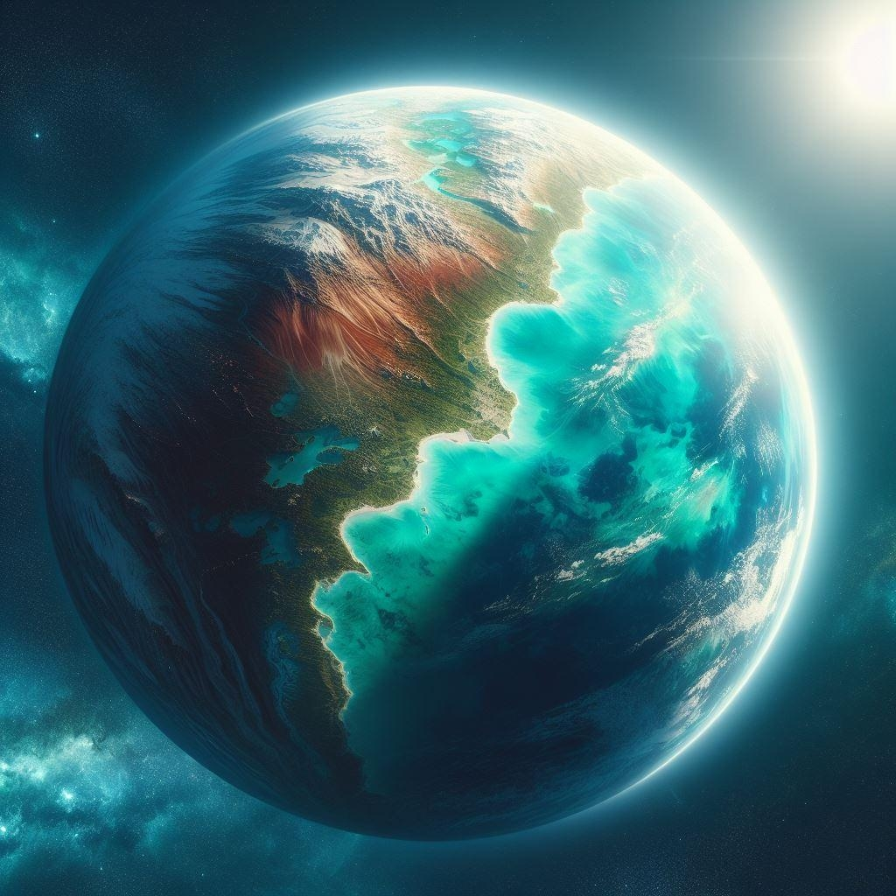

# אקוואריה

!!! Info "התייחסויות"

    זהו דף שמדבר על מושבת *אקווריה*. למידע על הזן החוצני, ראו את הדף על [הזן האקוורי](../זנים/קסנו-ויטה/02-aquari.md)

{ align=left width="300" }

## מלחמת האזרחים האקווארית והסכם סלאת׳אי-פיטרס

כמו שאי אפשר לדבר על אוניברסיטת מאדים מבלי לדבר על האוכל המזוויע בקפיטריה (אני מסתכל עלייך, פשטידת תרד), כך לא
ניתן לדבר על מושבת אקוואריה מבלי לדבר על מלחמת האזרחית האקווארית.

במקור, היה הכוכב חלק מממלכת א׳קי (שמם של האקווארי לבני-זנם), הממלכה שאיחדה את שלושת הכוכבים האקווארים תחת
בית המלוכה. הכוכבים שלושתם מכוסים אוקיאנוס, בהם מתגוררים בני הזן השלט (עוד על זן האקווארים בפרק הרלוונטי). **כוכב
ג׳נאי** (שלימים יקרא אקוואריה) היה חריג בכמות האדמה היבשה שהכיל: בעוד בשניים האחרים (אינאי וסומאי) קיימים בקושי כמה
עשרות אלפי דונמי אדמה יבשה, בכוכב ג׳נאי קיימת ממש יבשת גדולה, שמרכיב שמינית משטח הכוכב.

עוד במאות השנים לפני המפגש עם הצי האנושי בשנת 2370, התפתחה בג׳נאי אי-נחת ממדיניות בית המלוכה והממשל בכוכב, שזכה
ליחס מפלה בשל דינמיקות בין מיעוטים אתניים אקוואריים. שני נסיונות מרד (שמקבילים באופן מפתיע לשנות מלחמות העולם אצלנו)
דוכאו בקלות יחסית, ולא סחפו אחריהם את ההמונים.

אך המפגש עם הצי האנושי וההזמנה להצטרף לפדרציה היווה עבור תושבי אקוואריה (אז, עדיין בשם ״ג׳נאי״) הזדמנות להיחלצות
מהאפליה שספגו מבני עמם, והזדמנות לצבירת כח פוליטי. בית המלוכה הסתייג מההתלהבות האקווארית. בשל כך (ועוד אלפי סיבות,
רובן קשורות בכסף וכוח וחלקן קשורות למרבה ההפתעה לתקלה במערכות הביוב), סירב בית המלוכה להצטרף לצי האנושי, ובתגובה -
פרצה מלחמת האזרחים האקווארית.

הייתה זו מלחמה כמו שאר המלחמות: דם, סבל, תככים ומזימות. לבסוף, עם דעיכת הקרבות, התכנסה בשנת 2436 בבירת אקוואריה
פסגה ובה נחתם הסכם בין רלאש סלאת׳אי, מנהיגת המורדים בבית המלוכה, לבין מאליק פיטרס, אדמירל תת-סקטור 8. במסגרת
הסכם סלאת׳אי-פיטרס, נחתמה הצטרפות הכוכב ג׳נאי לצי האנושי, וברית הגנה בין הצי למושבה החדשה ששינתה את שמה
לאקוואריה.

להסכם היה סעיף סודי, שנשמר כך כדי לא לעורר את זעמ השל הקונפדרציה: הגירה מאסיבית של בני אדם מכדור הארץ, בעקבות
קושי באותה תקופה לעמוד בפרץ ההגירה למאדים. ההגירה הייתה גם אינטרס של האקווארים: התיישבות אנושית תבטיח את
מחויבות הצי להגנה על הכוכב, כמו גם תסייע בשיקום הכוכב שחווה פגיעה קשה במלחמת האזרחים.

## מושבה בין האדמה לים

בכוכב בו שליש מהתושבים הם בני אדם שחיים על היבשה, ושני שליש אקווארים שחיים בים, לא מפתיע לגלות שהמרחב בו גרים,
עובדים, וסוחרים רוב האנשים יהיה בדופן הרקמה של שני עולמות אלה: החופים.

המבקר בלילות באחד ממאות ערי-החוף של אקוואריה יחזה במראה מפעים: ערים מוארות ותוססות, המתפרסות עד לקו המים -
ואז לתוכו, כאשר מתוך המים מבצבצים עוד אורות מרצדים, כאילו העיר ממשיכה באין מפריע. בהיעדר ירחים, ובשל כך בהיעדר גאות
ושפל, קו המים נשאר קבוע ברובו. הוא מהווה מרכיב קבוע במעל ממחצית הערים במושבה, שבנויים חציים על היבשה וחציים בתוך המים.

טכנולוגיה ארלניאנית ייחודית, ששימשה את האקווארים ביציאה מימות הכוכב אל החלל, הונדסה לאחור והפכה למכשירים שמאפשרים
לבני האדם לחיות חיים נוחים בים. מרבית בני האדם בכוכב עדיין יעדיפו את החיים באוויר הפתוח, בשל תופעות הלוואי של החיים תחת
הלחץ של האוקיאנוס, החמורה מביניהן: אי היכולת לאכול גלידה בדרך הביתה מהעבודה.

אפרופו עבודה - הכוכב המימי עיצב באופיו את מרבית הכלכלה. תעשיית האצות למאכל, שמשתמרות טוב להפליא בחלל ולאורך זמן,
כמו גם חציבת המלחים (בכוכב נתגלו אחד-עשר מלחים שונים שלא היו מוכרים לאנושות לפני-כן), הם רק חלק מהתעשיות הייחודיות
שעל פני הכוכב.

## עצמאות אקווארית מעוגנת בשיטת המשטר

כחלק מהסכם סלאת׳אי-פיטרס, נקבע שבראש המדינה יעמוד נשיא ממפלגת **״המים-החופשיים״**, המפלגה שהובילה את המאבק נגד בית
המלוכה האקווארי. השלטון ניתן למפלגה לשני עשורים, לטובת שמירה על היציבות ושיקום הכוכב ממלחמת האזרחים.

אך ממש כמו האחיין שלי, שמקבל ממני את משקפי המציאות הרבודה שלי כשהוא בא לביקור כדי לשחק במשך שעה ובתום השעה
מסרב להפסיק לשחק, כך גם מפלגת המים החופשיים. כל עשור מאז כינון המשטר בשנת 2439, מאריכה הממשלה את תקנות השיקום,
וממשיכה את שלטונה.

בעקבות ביקורת מרחבי הצי ולחץ מהשלטון הפדרלי, הוקם גם קונגרס ייצוגי אליו מתקיימות בחירות דמוקרטיות. בפועל, מפלגת המים
החופשיים והעומד בראשה בארבעים השנים האחרונות סלאשן נסאקאי מכתיבים את הטון ברוב הנושאים שעומדים על סדר היום של
המושבה. בצעד נפוטיסטי בלתי-מפתיע, אחיו של הנשיא שאש נסאקאי הוא נציג המושבה למועצת הצי. נסאקאי אמנם נבחר בבחירות
דמוקרטיות, אך כשהנשיא מחזיק בכל כך הרבה כח מתוקף תקנות השיקום, קשה ליריביו הפוליטיים להציב אלטרנטיבה.

למרות המציאות האוטוקרטית הזו, לא מופעלת אלימות או דיכוי ברמה חריגה כלפי אוכלוסיית בני האדם. זו שמורה בעיקר למתנגדי
משטר ואוהדי ממלכת א׳קי.
