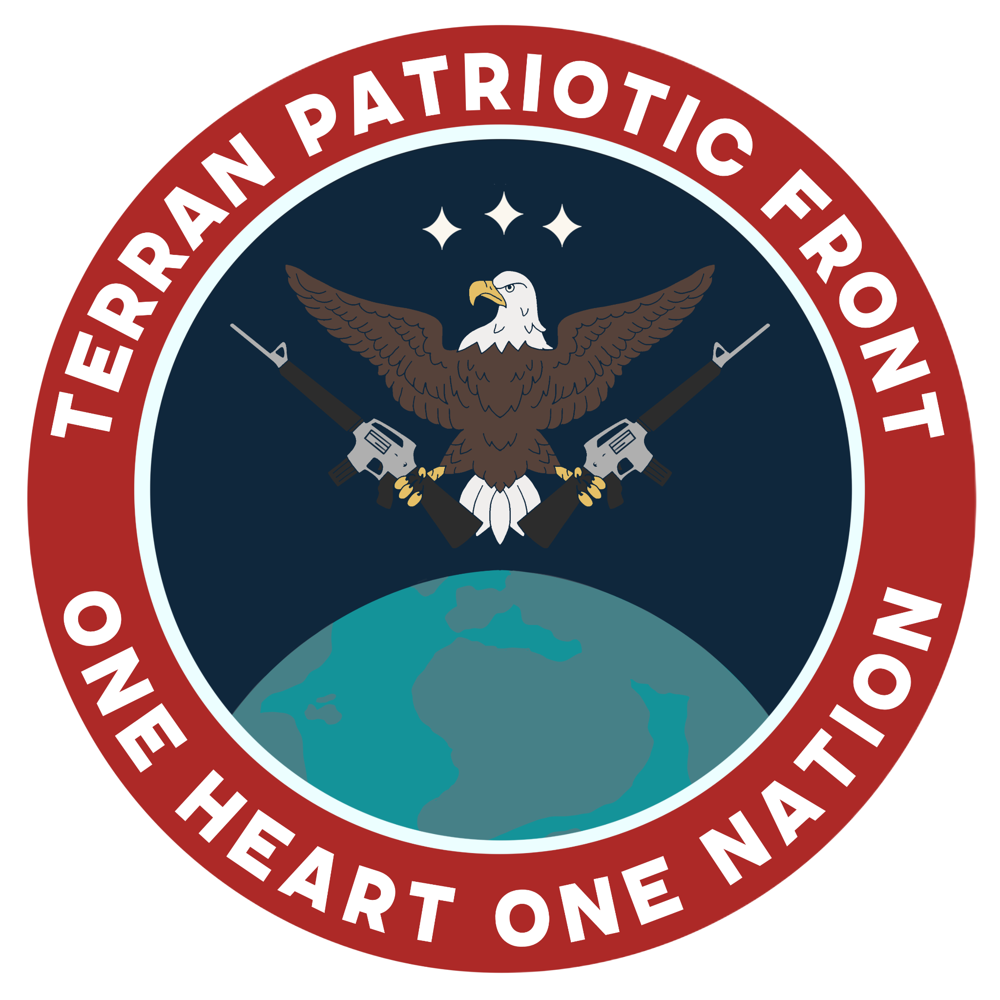

# החזית הפטריוטית של טרה

{ align=left width="300"}

## שורש המחלוקת - האנושות והחוצנים

בכל חברה אנושית מאז שחר ההיסטוריה, מהפכות רעיוניות מתחילות מן השוליים ומסתיימות אצל האליטה, שמאמצת אותם
כאילו היו שם תמיד. גם המהפכה הרעיונית האדירה של החיים לצד חוצנים התחילה בשוליים ותחילה נתקלה בעיקר בחשדנות,
ותוך שנים הפכה לקו המנחה של הפדרציה.

אם עבור המהפכה הצרפתית הייתה זו הצהרת זכויות האדם, שהפכה למגדיר הזהות הלאומית אחרי מאות שנות מונרכיה, עבור
האנושות בחלל היה זה ״קודקס הזנים״. הקודקס, מסמך שנוסח בשנת 2223, שנה לאחר הקמת הפדרציה וקצת יותר מעשרים
שנה לאחר המפגש עם [הקודומא](../זנים/קסנו-ויטה/01-kodoma.md) - הפך בדומה להצהרת זכויות האדם, למסמך היסוד הזהותי
של הצי. הוא קיבע לנצח בעיני אליטת הצי - הפוליטיקאים, קציני הצבא, המדענים, ובעלי ההון - את היחסים השוויוניים
בין בני אדם לחוצנים שיפגשו בחלל. הוא דרש יחס של שלום לכל זן שוחר שלום, והצעה להשתלבות בפדרציה כחלק מכינון
אימפריה גלקטית כלל-זנית.

וככל רעיון שהופך לבון-טון בקרב האליטה, הוא מקים כנגדו מתנגדים. מראשית המפגש עם חוצנים בחלל, פלגים אנושיים רבים
היו סקפטיים בנוגע לשיתוף פעולה עימם. הקיצוניים שבהם אף דרשו מלחמת מנע, חיסול מקדים לכל זן אותו תפגוש האנושות,
מחשש שהזן הזה מסתיר טכנולוגיה מתקדמת (כזו של [הארלניאנים](../פלגים/05-independent-entities.md#_2)), שעלולה להביא
לקץ האנושות. בשנת 2225, קמה במושבת לונאר מפלגת ["פאטריה"](../הצי%20האנושי/06-fleet-parties.md#pph), ששמה לה למטרה
להיאבק בשילובם של הקודומא (ובעתיד, זנים נוספים), בחברת בני האדם.

הנהגת הצי הצליחה למנוע מהקולות האלה לצמוח באופן אפקטיבי במשך רוב שנותיה, דרך תעמולה, בריתות פוליטיות, וקיצוצי
תקציב לעקשנים שבין המתנגדים לסטטוס קוו החדש שנוסד. כתגובה לרדיפתה הפוליטית את מפלגת פאטריה, הקימו תומכי
המפלגה בשנת 2291 את מושבת [טרה-לונה בסמוך למושבת לונאר](../מושבות%20הצי/08-former-colonies.md#_2). הנהגת טרה-לונה
אומנם לא יכלה להגביל כניסה של זנים חוצנים למושבה (עד שהסירה בשנת 2490 את ״קודקס הזנים״ מחוקת המושבה), אך מראשיתה
הייתה עוינת אותם.

במשך מאות שנים, מלבד בטרה-לונה, הצליח הצי לרסן את מתנגדי החוצנים. אך ריסון ההתנגדות יכול להוביל לעיתים קרובות
להתפרצותה בנקודת החולשה הגדולה ביותר. ואכן, בשנת 2677, אחרי שהזעם האנטי-חוצני הועצם עם הפחד של ההמונים
[מהזיגוטים](../זנים/מכה-ויטה/02-zigots.md) - האנדרואידים המשודרגים - אדמירל בכיר בצי האנושי ניסה להוביל הפיכה
בטרה-לונה, והצליח לגייס אף את מושבת לונאר השכנה. הצי אמנם הצליח לדכא כעבור ארבעה חודשים את ההפיכה, אך הזרע למרד
בהנהגה אנושית משותפת אחת כבר נזרע.

חשוב לומר: לומר שהסנטימנט הקסנופובי הוא מה שהוביל מאז ומתמיד את מתנגדי הצי תהיה אמירה דמגוגית ומשוללת קשר
למציאות. נכון, מנהיגי פאטריה, ואחריהם מנהיגי החזית, השתמשו תמיד ברטוריקה משלהבת כנגד זנים לא-אנושיים. אך הם
דיברו אל ליבם של ההמונים, ואל חששות אמיתיים, ובראשם הביטחון התעסוקתי.

## עלייתה של ג׳מבה אוקאפור

לא הרבה ידוע לנו על ילדותה של ג׳מבה אוקאפור, מי שלימים תהיה המנהיגה העליונה של החזית הפטריוטית של טרה. היא
נולדה בשנת 2737 במושבת טרה-לונה, לאמא מהנדסת ואבא ווטרן של
[מלחמת הבראקל הראשונה](../היסטוריה/03-brakkal-wars.md#-2731-2777), משותק מכף-רגל ועד ראש. היא סיימה בהצטיינות, ראשונה
במחזור שלה בבית הספר לקצונה בבסיס ליברטי. בתוך חמש שנים מסיום קורס-הקצינים, בזכות אומץ רב וכושר לחימה
יוצא דופן, הפכה לאחת החיילות המעוטרות בצי. היא הייתה האדמירלית הצעירה ביותר שמונתה אי-פעם בצי כאשר הפכה
לאדמירלית המבצעים המיוחדים בגיל 33 בלבד.

בשנת 2773, לקראת סופה של מלחמת הברקאל הראשונה, מונתה לאדמירלית המודיעין של הצי. נוטים לשכוח את תרומתה
המכרעת לבלימת-מנע של מבצעים רבים של הברקאל בזמן כהונתה בתפקיד זה, ויש שיטענו שבאופן אירוני מניעה זו היא
שבכלל גרמה לברקאל להיכנס לשולחן המשא ומתן.

כאשר הגיעה ההצעה הברקאלית לשביתת נשק ומשא ומתן ללא תנאים מוקדמים, ג׳מבה הייתה מהקצינים הבולטים
שהתנגדו נחרצות. ההחלטה לא הייתה נתונה בידיה, כמובן, אלא בידי מועצת הצי, ולכן ג׳מבה פעלה באופן חריג והתראיינה
בתקשורת כנגד ההצעה. היא נפגשה עם נציגי מועצת הצי ועם אדמירלים בכירים נוספים וניסתה ללחוץ עליהם להתנגד גם.
ומקביל, ככל הנראה, הכינה את השטח לקראת יום הדין.

כשהוא הגיע, ואדמירל הצי טס לפגישה עם [קיסר הארגמן](../פלגים/04-brakkal-empire.md#_3), קרה דבר שרבים חשבו אותו
לבלתי אפשרי: אלפי קצינים מרדו במפקדיהם, והכריזו כי הם אינם נאמנים יותר לצי האנושי -
אשר בגד באנושות. 3 מחברי מועצת הצי בעצמה, נציגי שלוש המושבות של הירח וכולם חברי מפלגת פאטריה, הכריזו על עריקת
מושבותיהם מהצי האנושי, ועל התייצבותן מאחורי האדמירלית ג׳מבה אוקאפור, מנהיגת מרד הקצינים.

עם שקיעת אבק ההפיכה, התחוור לכל כי הירח כולו בשליטת החזית הפטריוטית, כמו גם מושבת **יורופה**. כשישית
מאוכלוסיית הפדרציה הייתה תחת שלטון חדש. מבחינה צבאית, המצב היה חמור אף יותר: כשליש מהצבא ערק והפך
לצבא החזית הפטריוטית של טרה.

חודש לאחד המרד, התקיים כינוס במה שהיה עד רגע לפני כן בניין מועצת הצי האנושי. דגל חדש התנוסס מגגות
הבניינים: במקום הכחול העמוק של הצי עם חץ הקדמה והכוכבים, ניצב דגל אדום בוהק עם סמל כדור הארץ, הנשר
הלוחמני, והנשקים השלופים. על הבמה, במדים כהים חדשים, עמדה ג׳מבה אוקאפור, והוכתרה בהוד והדר כמנהיגה
העליונה של החזית הפטריוטית של טרה. את המעמד ניצלה המנהיגה העליונה להכריז על החלטתה הראשונה: הכרזת
מלחמה על הברקאל. בסוף דבריה הוסיפה איום על הצי האנושי - פן יעמוד בדרכה. בתגובה, כיתרו כוחות
הצי את מושבות החזית, וכידוע, רגע לפני שהמצב הסלים למלחמת אזרחים, הברקאל תקפו.

## בנייה של פלג חדש

[מלחמת הברקאל השנייה](../היסטוריה/03-brakkal-wars.md#_3) הייתה המלחמה הקשה ביותר שידעה האנושות בחלל.
אבידות בסדרי גודל בלתי נתפסים, אובדן שטחי שליטה נרחבים, ומוראל שהלך והתדרדר. לצד הלחימה בברקאל,
לחזית הפטריוטית היה אתגר נוסף: בניה מחדש של יישות פוליטית, צבאית, וחברתית. ניתן לחלק את תקופת הבנייה-מחדש
הזו לשני חלקים משמעותיים: זה שבתקופת הנתק בין החזית לצי, וזה שלאחר מכן, עם הקמת הברית המשולשת ושילוב
הכוחות במאבק בברקאל.

חודשיים לתוך כהונתה, הכריזה ג׳מבה אוקאפור על ״חוקת החזית״, שכללה כמה חלקים מרכזיים:

* עיגון משטר אוטוקרטי בראשותה, במסגרתו היא, המנהיגה העליונה, מהווה גם את ראש המדינה, השופטת העליונה
  ומפקדת הצבא.
* גיוס חובה לצי לכל אדם בין הגילאים 16-30.
* הלאמת כל מפעלי התעשייה, הספינות והנשק בשטחי החזית (מלבד מושבת השמיים, שהוחרגה תמורה להבטחה
  של תמורה כספית משמעותית) והפעלתם כחלק מהצבא.
* הוצאת ״קודקס הזנים״ מחוץ לחוק, והטלת עונש מוות על כל חוצן, או כל אדם שמסייע לחוצנים.

בנוסף, העניקה אוקפאור סמכויות נרחבות לגוף חדש שהקימה בשם ״הגדודים הפטריוטים״, שתפקידם היה לגרום
למימוש החוקה, במהירות האפשרית. ובמהירות, הכוונה היא כמובן - בכח רב, באלימות, ברדיפה ובאיומים.

בתום שבע השנים הראשונות, הושגה יציבות יחסית בתוך החזית הפטריוטית, שהצליחה לבנות את עצמה במקביל
ללחימה בברקאל, אשר נעשתה ללא תיאום עם הצי. ככלל, החזית בראשותה של ג׳מבה נמנעה מחיכוך עם הצי האנושי,
מטעמים שהיו ככל הנראה פרגמטיים לחלוטין. גם הצי, לאחר המהלומה הקשה שחטף מהפילוג מצד אחד ומהברקאל
מהצד האחר, לא שש להתנגח בחזית בעצמו.

המתקפה על [תחנה 404](../מושבות%20הצי/08-former-colonies.md#404) בשנת 2784 שינתה את הסיפור. עד היום הגרסאות
חלוקות על מי הזמין את מי לשולחן המשא ומתן, אך בשורה התחתונה, נחתמה ב״ועידת גנימד״ ברית בין החזית לצי.
מלבד שיתוף פעולה בין הפלגים, נעשו ויתורים משני הצדדים: הצי הסכים לספק נשקים וחלליות מתקדמות לחזית. בתמורה,
השיג הצי ניצחון סמלי, אך חשוב בעיניו: בוטל עונש המוות לחוצנים ולמשתפי הפעולה עימם בחזית. לא היה מדובר בשינוי
היחס לזנים זרים בתוך החזית, כמובן. אך הצי לא יכול היה להרשות לעצמו לשתף פעולה עם מי שעלולים לרצוח את אחד
מקציניו בעגינת ביניים.

שנה לאחר מכן הצטרף גם צבא [הקונגלומרט](../פלגים/02-celestial-congolomerate.md) של אבאזו ניראר לעסקה ומנקודה
זו המשיך קרב הבלימה המשותף, שסופו בדחיקת הברקאל בחזרה אל סקטור דלתא וסיום מלחמת הברקאל השנייה.

## החזית כיום

החזית הפטריוטית של טרה ציינה לא מזמן את עשרים שנות קיומה, ואפשר לומר שבתום שני העשורים הראשונים,
הפלג התייצב. ועידת החזית הפטריוטית של טרה, הגנרלים שג׳מבה ממנה, ואשר מנהלת את כל תחומי החיים -
מניהול הצבא ועד תחזוקת הביוב - מצליחה עד כה לשמור על יציבות. הגיוס עדיין בגדר חובה בגילאי 16-30, בניגוד לצי,
בו השירות הוא מסלול מקצועי וולנטרי. וכמובן, עדיין לא מתקיימות בחירות: מפלגת ״החזית הפטריוטית״ היא המפלגה
החוקית היחידה.

ניתן לומר בפשטנות שהחזית הפטריוטית היא דיקטטורה מסוגרת ואלימה שרודה בתושביה ומדכאת את כל מתנגדיה,
ועד לשנת 2784 אמירה זו הייתה כנראה נכונה, אך כניסת החזית לברית יצרה מציאות מורכבת יותר. שיתופי הפעולה
הצבאיים, הסחר שהלך והתרחב והמעבר החופשי של סוחרי וחיילי הקונגלומרט בשטחה (מתוקף ״הויזה הכתומה״ -
עוד עליה בפרק על הקונגלומרט) - טשטשו קצת את הגבולות ההרמטיים של ראשית דרכה של החזית. הגירה, תיירות
וביקורי קרובים בין שטחי הצי לחזית אומנם אינה מוסדרת, אבל גם איננה דבר נדיר (לבני אדם, כמובן).

עם תבוסת האויב המשותף, סיום מלחמת הברקאל השלישית מציבה מתחים בפנים הברית בין הצי האנושי לחזית,
וככל שעוברים החודשים נדמה שמלחמה קרה בין השניים לשליטה על סקטור דלתא, דרך ארגוני פרוקסי למיניהם,
הולכת וגוברת. הברית המשולשת עודנה עומדת, אך נדמה שהיא רגישה מתמיד.
