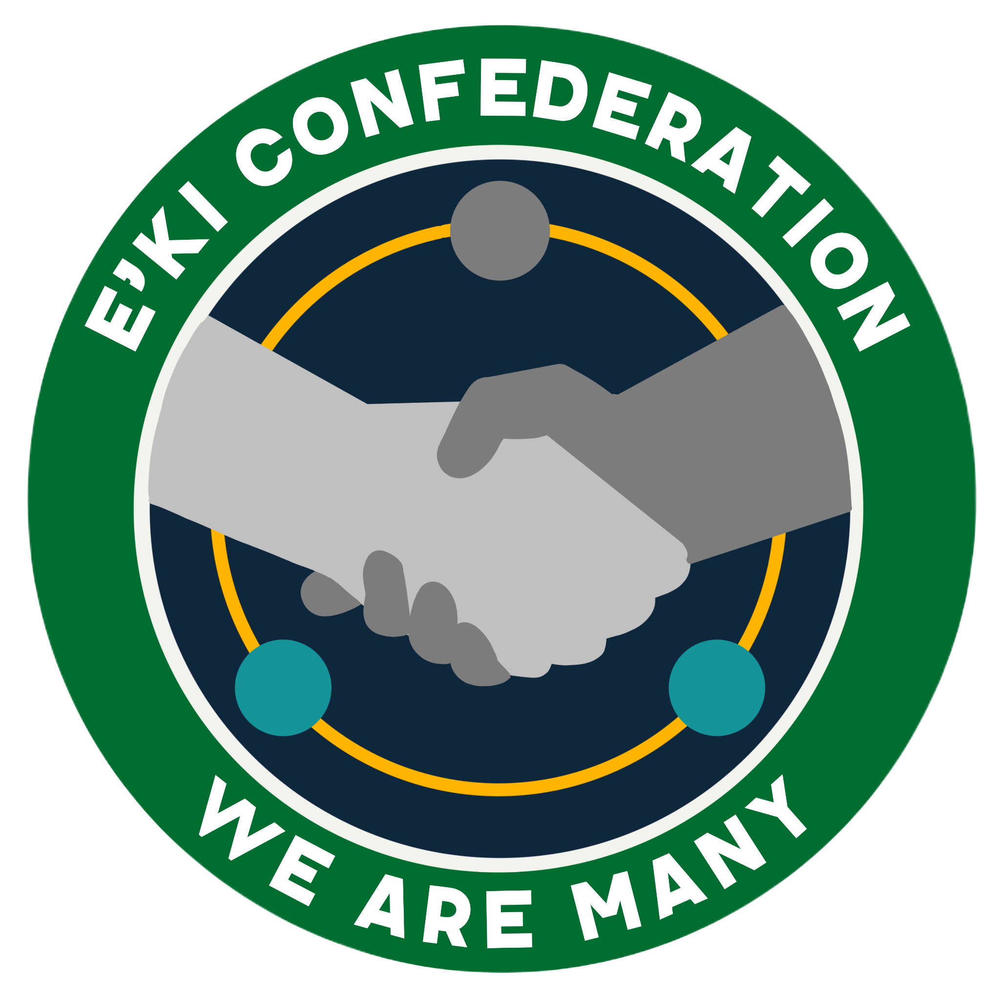

# קונפדרצית א׳קי

{ align=left width="300"}

## שושלת אינאי

קונפדרצית א׳קי היא הפלג השני הגדול ביותר שאינו כולל בני אדם, ביקום הידוע לנו. כדי לרדת למקור הקונפדרציה, חשוב
להתחיל במייסדיה - האקווארים (המכונים א׳קי בלשונם). ובאופן ספציפי, האקווארים של כוכב אינאי.

בשביל להבין לעומק את כל ההיסטוריה של הכוכב, צריך כמה וכמה ספרים עבי-כרס (או קבצים ששוקלים פחות מ-4
מגה-בייט). אנסה לתמצת: כוכב הלכת אינאי קיבל את שמו משבט אינאי שבפעם הראשונה בתולדות הכוכב איחד את
מרבית שטחיו (נזכיר לקורא השכחן - שטחים מתחת לפני הים שמכסה את כל הכוכב) תחת בית מלכות אחד.

שושלת אינאי שלטה בכוכב בערך במקביל למאה העשירית עד המאה העשרים לספירה שלנו - קצת מעל אלף שנים.
סביב שנת 1700 לספירה האנושית, הצליחו בכוכב להגיע לכוכב לכת סמוך, ובעל תנאים דומים, ושמו נקרא ״אינאי 2״.
שימו לב שהאקווארים הצליחו לצאת מהאטמוספירה שלהם 250 שנים לפני האנושות. הקדמה זו שלהם אותנו
התאפשרה בזכות העובדה שהאקווארים התרגלו במשך מאות שנים לבנות קונסטרוקציות בעומק הים בתנאי לחץ
גבוה. תרגום הטכנולוגיה הזו לכלים שיכולים לשרוד מחוץ לאטמוספרה היה פשוט באופן יחסי.

מאתיים שנה לאחר מכן, סביב שנת 1900, הוביל שבט סומאי מרד בשושלת אינאי בכוכב אינאי 2, וכוכב סומאי זכה
בשמו החדש ובעצמאותו. קרואים סקרנים וודאי יתהו: ״האם זו לא הייתה אם כך מלחמת האזרחים האקווארית
הראשונה?״ אך האמת היא שהטכנולוגיה דאז לא הייתה מפותחת במיוחד, ובקושי ספינת תובלה או שתיים היו
עוברות בין הכוכבים. בגדול, האקווארים המתיישבים הגיעו, הבינו שאם ימרדו אין מי שיעצרו אותם, ומרדו. מרד זו
אולי מילה גדולה לזה. יותר כמו עריקה מנומסת.

מרד סומאי היה הזרז שהפיל את השלטון הריכוזי של שושלת אינאי. כמהלך נואש להציל את שלטונו, החליט בית
המלוכה לחלק אוטונומיה מרובה לשבטים השונים, כולל ריבונות על שטחים וסמכויות גביית מיסים, בתמורה
לנאמנות לכס המלוכה ושירות בצבאו. השינוי אמנם היווה מכה קשה לשושלת אינאי, אך הציל את אחיזתה בשלטון
(עד כתיבת שורות אלה).

בשנת 2117 (כאן כבר יש לנו מידע מדויק על הזמנים בזכות תחילת הספירה האקווארית, שהתחילה עם נפילת
הממלכה) הגיעה אל כוכב אינאי משלחת [מהלודו](../זנים/קסנו-ויטה/04-ludo.md), שכוכבם עבר במערכת הכוכבים
האקווארית. הלודו לא שיחקו משחקי פוליטיקה ולא דיברו על בריתות או מלחמות. כל שעניין אותם היה סחר
עם האקווארים - ואכן הסכם סחר רחב היקפים נחתם בין שתי האומות.

בשנת 2178 הוכרזה ברית אסטרטגית בין אינאי וסומאי, ובעקבות תמורות פוליטיות שקצרה היריעה מלפרט כעת,
נשבעו תושבי סומאי אמונים שוב לבית המלוכה. בשנת 2202 משלחת משותפת התיישבה על כוכב חדש, דומה גם
הוא לאקלים בשני הכוכבים האחרים אך בעל אחוז ניכר של יבשה. בהסכמת שני הצדדים, מונה שבט ג׳נאי (שלא
היה מזוהה פוליטית עם שני השבטים האחרים) לנהל את ענייני הכוכב, והכוכב זכה בשמו.

## הקונפדרציה - משקל-נגד לצי האנושי

אך הניסיון לשמור על ממלכה מאוחדת בשלושה כוכבים היה רווי קשיים. המאה ה-23 הייתה מלאה במגיפות,
הרעלות של גופי המים ואי-שקט פוליטי. כאשר פגשה האנושות בשנת 2370 את האקווארים, היא פגשה זן במשבר,
על סף מלחמת אזרחים. הצי שלח משלחות דיפלומטיות לשלושת הכוכבים, והציע לאקווארים להצטרף לפדרציה.

מרבית תושבי ג׳נאי, הכוכב שנפגע הכי משמעותית מתהפוכות המאה הקודמת, תמכו בהצטרפות, ומולם הקול
הרווח באינאי היה זה של ההתנגדות. הכוחות הפוליטיים בסומאי היו חלוקים. הידללות המשאבים, והמתח ההולך
ונבנה, הוביל [למלחמת אזרחים](../היסטוריה/02-golden-age-of-space.md#_3) שהחלה ב-2377 ונמשכה 59 שנים,
עד לסיומה בשנת 2436.

עד היום, האקווארים הנאמנים לבית המלוכה טוענים שלאורך כל שנות המלחמה הצי האנושי סייע לתומכי
ההצטרפות בכוכב ג׳נאי ומחוצה לו בנשק, מידע מודיעיני, ואספקה. אמנם אף פעם לא בלחימה עצמה - אבל זה
לא הדבר שמכריע מלחמות. עד היום הצי מכחיש מעורבות במלחמת האזרחים האקווארית. גם אם אין לכך עד
היום הוכחות מהימנות, ניתן להסיק שלצי וודאי היה אינטרס לניצחון כוחות ה״הצטרפות״. והיכן שיש אינטרס, כך
למדתי לאורך השנים, בדרך כלל גם יש ידיים פועלות.

מלחמת האזרחים הסתיימה כביכול בהסכם הפסקת-אש בין הצדדים, אך בפועל היה יותר משקל להצלחת כל
אחד מהפלגים לדכא את ההתנגדות מבית. כוכב ג׳נאי שינה את שמו לאקוואריה והצטרף את פדרצית הצי האנושי,
והותיר את הכוכבים סומאי ואינאי מחוץ לתמונה. התגובה לא איחרה לבוא.

ארבע שנים לאחר תום המלחמה, בשנת 2440, בכינוס מיוחד באינאי, הוכרזה הקמת קונפדרצית א׳קי. שלוש
ישויות נכללו תחת מטריית הקונפדרציה: אינאי, סומאי, וראמה-לודון, כוכבם של הלודו. מלכת שושלת אינאי דאז,
נסלאן אינאי, הכריזה:

> ״פדרצית הצי האנושי, היא אם כל הרוע בגלקסיה. והם חייבים לזכור: אנו רבים יותר. ואנחנו לא נהסס להגן
> על עצמנו.״

## היחסים עם הצי מאז מלחמת האזרחים האקווארית

בניגוד לפדרציה האנושית, שכל מושבה חדשה שלה אמנם בעלת אוטונומיה, אך כפופה לשלטון מרכזי -
הקונפדרציה מתנהלת באופן מבוזר יותר. לכל אחד מהפלגים בה יש אוטונומיה מוחלטת, ואין מועצה עליונה
של הפדרציה שמקבלת החלטות משותפות על מיסוי, הגירה, וכו׳. מה כן יש: הסכמי מסחר ענפים, וברית הגנה
צבאית. הוקם גם כח צבאי משותף - צי הקונפדרציה - אך לכל אחת מהישויות העצמאיות עדיין נותר
צבא משלהן, גדול מצי הקונפדרציה.

מנהיגי החברות בקונפדרציה טענו לאורך כל השנים שאין להם עניין במלחמה עם הצי האנושי, ושמטרתם
היא להקים ברית הגנתית בלבד כדי לשמור על האינטרסים שלהם. בפועל, פעלו מאחורי הקלעים, באופן תדיר,
באמצעים ישירים ודרך ארגוני פרוקסי, לערעור יציבות הצי.

אחד האירועים המרכזיים בעניין זה היה פרשת ההתנקשויות האקווארית, תקופה ששיאה בשנים 2536-2539,
במהלכה שלח בית המלוכה מתנקשים לפגוע בבני אדם בכוכב אקוואריה. הצי האנושי אמנם הבליג על
המתקפות כדי לא להסלים את המצב באזור, אך כוחות מיוחדים נשלחו לנטרל את המתנקשים לפני ביצוע
הפיגועים.

בנוסף, גורמים בקונפדרציה פעלו תמיד לזרוע חוסר-אמון בין הגורמים האנושיים בצי לבין החוצנים שבחרו
לקחת בו חלק. פעמים רבות ניסו סוכני קונפדרציה לשחד את דרכם אל מנהיגי הקודומא כדי לשכנע אותם
לערוק לקונפדרציה, אך כשלו בשל מחויבות הקודומא למושבה 18 המשותפת עם הצי. אל הפלאקור הצליחו
להגיע כמעט ביחד עם הצי ועם הצעה נגדית, אך מאמציהם לא נשאו פרי.

עם פרוץ [מלחמת הברקאל הראשונה](../היסטוריה/03-brakkal-wars.md_-2731-2777), היה ניסיון לקיים יחסים
דיפלומטיים עם הברקאל, אך אלה לא הראו עניין בברית כלשהי עם הקונפדרציה, והנהגת הקונפדרציה
העדיפה להישאר מחוץ לסכסוך. במהלך מלחמת הברקאל השנייה, כאשר הנהגת הצי פנתה בחשאי ואפילו
בפומבי בקריאה לקונפדרציה לקחת חלק בבלימת ההרס הברקאלי, זו האחרונה סירבה להשתתף במלחמה.

מאז סוף [מלחמת הברקאל השלישית](../היסטוריה/03-brakkal-wars.md#-2799-2800) ותבוסתם של הברקאל,
קיימת ברשתות תעמולה רבה נגד הברית המשולשת שמכוונת ללא-אנושיים, הכוללת הפחדה על השמדה של
זנים נוספים. הקונפדרציה פרסמה בפומבי הצעת מקלט לברקאל ששרדו, והציעה מעמד פליט לכל תושב הצי
שמצהיר שהשהות בפדרציה ״מסכנת את בטחונו האישי״.
