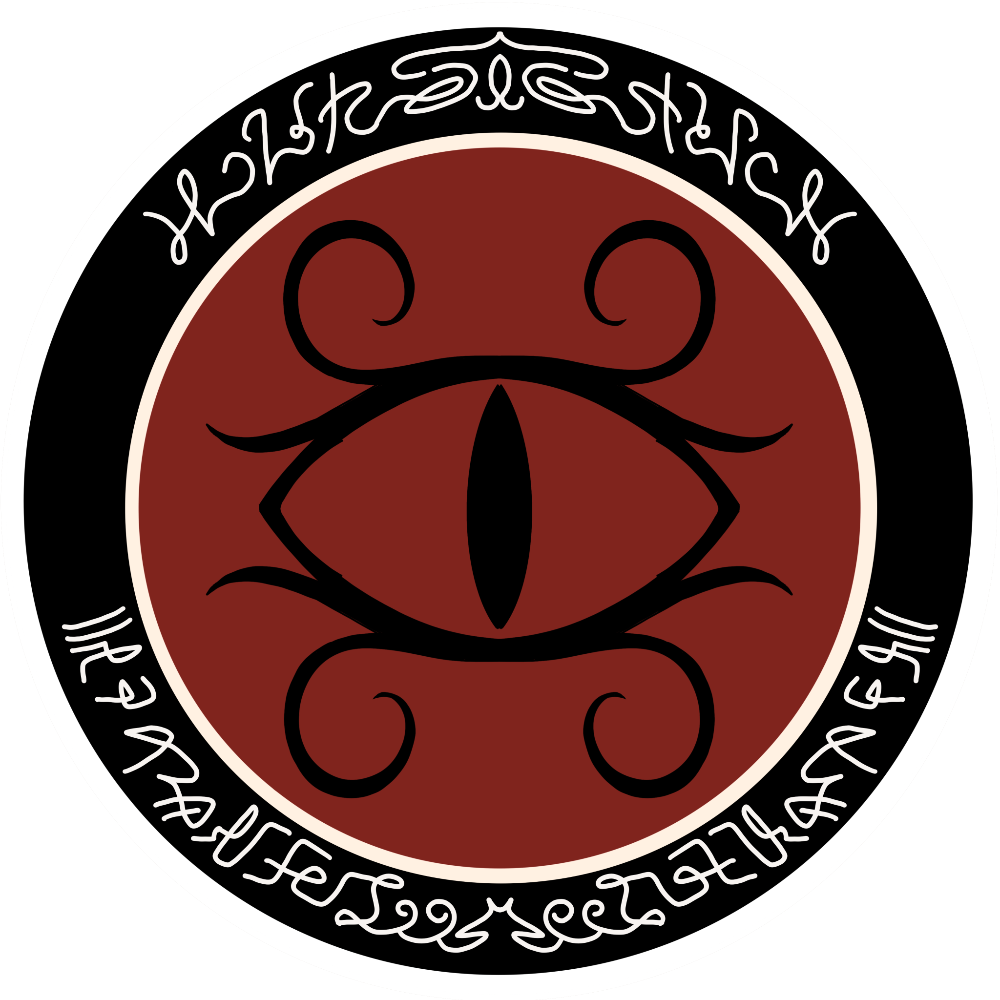

# קיסרות הברקאל

{ align=left width="300"}

## מלחמה תחילה

הדבר הראשון שלמדה האנושות על קיסרות הברקאל, היא שפניה אינם לשלום. ספינות הסיור של האנושות שחקרו את סקטור
דלתא בשנת 2730 הושמדו ללא התראה. ניסיונות דיפלומטיים רבים לא סייעו. הברקאל
[החליטו להילחם באנושות](../היסטוריה/03-brakkal-wars.md) ובבני בריתנו עוד לפני שפגשו אותנו.

השערות רבות עלו לאורך השנים לגבי הכוונות של הברקאל, הזן בעל מספר הפרטים הגדול ביותר מלבד האנושות (הוערך נכון
ל-2799 בכ-3 מיליארד). יש התולים זאת בפער תרבותי-תקשורתי, ושהאנושות לא השכילה להבין כיצד ניתן לפנות אליהם בסימנים
שמשדרים שלום. אחרים, חושבים שאילו הפילוג האנושי היה נמנע המצב היה הולך לכיוון אחר, טוענים שהברקאל בחנו את יכולות
האנושות והתכוונו באמת לשלום שהציעו באולטימטום שלהם בשנת 2777. וישנם אלה, הסקפטיים, שחושבים שאולי יש זנים שטבעם
להילחם.

לאורך כל שנות המלחמה, התקשה הצי לפתוח בשיח אפילו עם קצינים זוטרים בהיתקלויות שונות. תשדורות תקשורת נחסמו
אוטומטית על ידי הספינות ברוב המקרים, ושבויי מלחמה התאבדו כמעט מיידית לאחר שנשבו. גם את הכתב הברקאלי, שנכתב
בסנגון מיוחד על ידי שתי הידיים בכתב מראה לשני הכיוונים, מתקשים בלשני הצי לפענח עד הסוף, וגם מה שכן מפוענח - התוכן שלו
אינו קריא.

## קיסר הארגמן

בראש קיסרות הברקאל עמד קיסר הארגמן. קיסר הארגמן הוא דמות אניגמטית. רק אדמירל הצי ליברטי מונשיף, שטס עם משלחת
דיפלומטית בשנת 2777 לייצג את הצי האנושי במשא ומתן לשלום, זכה לפגוש אותו, ותיאר את הקיסר כך:

> ״מוסתר מכף-רגל ועד ראש בחפתי בד שחורים בלויים, כתר אירידיום כסוף לראשו, ועיניים כחולות עמוקות מציצות מתחת ברדס.
> צחוקו כמפולת אבנים,וקולו כקול המוות.״.

תחת קיסר הארגמן, כך ידוע לנו מהמספר הקטן של חיילי ברקאל שנשבו, מכהנים לא פחות מאלף שרי-שבטים. כל שר מייצג שבט
אחר של ברקאל, ולכל אחד מהשבטים - קעקועים שונים, מנהגים אחרים וסגנון דיבור יחודי. כל שנה, בראש השנה הברקאלי,
מתכנסים שרי השבטים בעיר הבירה הברקאלית, ומביאים עימם את בניהם ובנותיהם שהגיעו לגיל בגרות, על מנת להתגייס לצבא
הברקאל.

לגבי משפחת הקיסר עצמה, לא ידוע הרבה - כיצד הירושה עוברת ומתי לאחרונה התחלף קיסר. נדמה שקיסר הארגמן הוא התואר
של המנהיג של הברקאל, וששיטת הקיסרות קיימת כבר לפחות 800 שנים. לקיסר נשים רבות, וילדים וילדות רבים מהן, המכונים
נסיכים ונסיכות.

## טכנולוגיה ברקאלית

לגיסות הקיסר שפגשו את ספינות הצי בקרבות ברחבי החלל היה יתרון ברור על פני כל הזנים שנפגשו עם האנושות עד כה: בדומה
לצי האנושי, גם להם היה מנוע קיפול. פעם ראשונה בהיסטוריה, ניצבה האנושות מול כוח שווה ערך בשדה הקרב. בנוסף, לברקאל
היו אמצעי הגנה מתקדמים ביותר. שרשרת המוות שחגה סביב מערכת השמש שלהם (יש הגורסים שמדובר בתופעה מהונדסת, ולא
גרם שמימי סטנדרטי) הפכה את הכרעתם לכמעט בלתי-אפשרית לאורך כל שנות הלחימה.

לצד אמצעי ההגנה, השתמשו הברקאל בנשקים שהאנושות טרם פגשה. לא מדובר רק בנשקים ולייזרים מסגנונות דומים אך
ורסטיליים יותר ומותאמים ללחימת גרילה בחלל, אלא גם לנשקים רבי עוצמה אף יותר. זכור לכולם בעיקר כלי הנשק המסתורי,
שהפרטים לגביו חסויים עד היום, שהשמיד את [תחנה 404](../מושבות%20הצי/08-former-colonies.md#404) בן ליל.

## קסנוסייד

כשהתחלתי לכתוב את המסמך הזה, לא חשבתי שאצטרך לכתוב את הפרק הזה. אי אפשר לדבר על קיסרות הברקאל בלי לדבר
על שאלת השמדת הקיסרות. ולא די בלומר השמדת הקיסרות: השמדת תרבות, השמדת ידע. השמדת זן.

אין זה המקום לדון בטיעונים וצידוקים בעד ונגד המהלך שהכריע את המלחמה, וגם לא בהשלכות המוסריות של מעשה זה. בניגוד
לתועמלנים ולפוליטיקאים, ההיסטוריון הנאמן לאומנותו מאמין ביכולת הקוראים שלו לברור את המידע, להפריד בין עובדות, רעיונות
ודעות, ולגבש עמדה משלו. שהרי, אפשר להגיד שני דברים בעת ובעונה אחת: הברקאל מהרגע הראשון רצו להשמיד את הפדרציה
על כל זניה, והצליחו בהשמדת מאות מיליונים. וגם: לעולם לא נדע אם אולי אפשר היה להימנע מכל זה.
