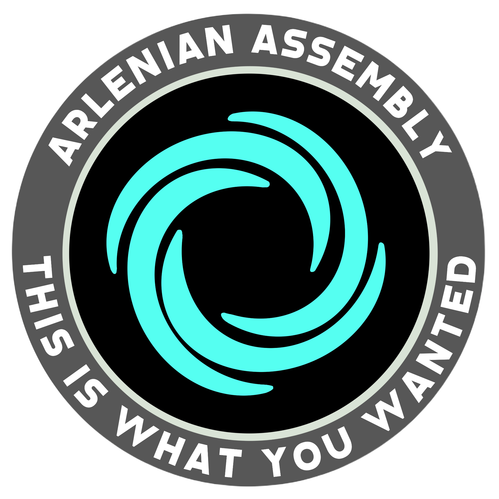
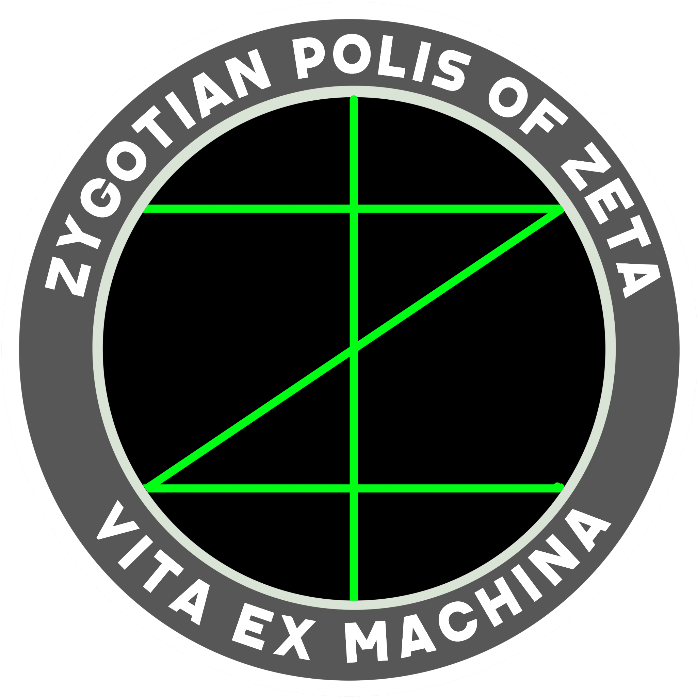

# ישויות עצמאיות

## האסיפה הארלניאנית

{ align=left width="300"}

מעט מאוד ידוע לנו על הארלניאנים, אף על פי שמדובר בזן הלא-אנושי הראשון שנפגש עם האנושות, ואפילו יותר מזה: מדובר בזן
שהביא לאנושות את האפשרות למסע אמיתי בין-כוכבים, באמצעות מנוע הקיפול.

האסיפה הארלניאנית היא פלג עצמאי. הארלניאנים לא משייכים את עצמם לאף גורם חיצוני ולאף אימפריה או צי, וסירבו באופן
קבוע להצעות להצטרפות לפדרציה. הטכנולוגיה שלהם מתקדמת ביותר, ולא נחלקה רק עם האנושות, אלא עם כל זן שהאנושות
פגשה בחלל, כאשר כל זן קיבל מהארלניאנים טכנולוגיה שונה על בסיס אותו מנוע אנטי-חומר. זה בעצם הדבר היחיד שידוע
עליהם: הארלניאנים מסתובבים ברחבי היקום, ובזמנם, כשמתאים להם, חולקים פיסת טכנולוגיה כלשהי עם אחד הזנים. כשהם
נשאלים שאלה שלא קשורה לתפעול המכונות, או לשימושים אפשריים, הם עונים במשפט אחד: ״זה מה שרציתם״.

אלו הכלים שנתנו הארלניאנים לזנים השונים:

* [בני האדם](../זנים/הומו-ויטה/01-humans.md) - מנוע-קיפול, המאפשר תנועת חלליות (ובמקרים מסוימים, תחנות חלל)
  דרך קיפול מרקם המרחב.
* [קודומא](../זנים/קסנו-ויטה/01-kodoma.md) - מחולל-כבידה, המאפשר יצירת כבידה ללא צורך במסה תואמת.
* [אקווארי](../זנים/קסנו-ויטה/02-aquari.md) - ממסר-מיידי, המאפשר העברת הודעות במהירות גדולה ממהירות האור.
* [פלאקור](../זנים/קסנו-ויטה/03-falkor.md) - סורק-עומק בין-גלקטי, המאפשר סריקה של עצמים בין מערכות שמש.
* [לודו](../זנים/קסנו-ויטה/04-ludo.md) - ממיר-חומרים, המאפשר המרת יסודות כימיקליים ביסודות אחרים.
* [**ברקאל**](../זנים/קסנו-ויטה/05-brakaal.md) - מנוע קיפול גם כן, והשמועות מספרות על פיתוחים נוספים שבידיהם
  שיכולות להעיד על מעורבות טכנולוגיה ארלניאנית נוספת.

לא ידוע כמה ארלניאנים קיימים או מאיזה כוכב מקור ומערכת שמש הם הגיעו. לפי ההערכות, מדובר בזן עם מספר פרטים
נמוך ביותר, לא יותר מכמה מאות, ואולי אפילו כמה עשרות בודדים. אין לדעת אם מדובר בריבוי הטבעי של הארלניאנים שהוא
נמוך דרסטית משאר הזנים, או שמא נכחדו בני מינם והם השורדים האחרונים.

מעטים אלו שפגשו ארלניאני בחייהם, ואפילו תיאור פיזיולוגי שלהם כמעט ואין לנו. פגשתי קסנולוגים שטוענים שהארלניאנים
דומים לאקווארים רק עם קרניים וזקנים ארוכים, ואחרים שטוענים שיש להם עשרה עיניים ויד אחת. מה שבטוח: מי שזוכה
למפגש עם ארלניאני, צריך להרגיש את עצמו בר-מזל ביותר. וככל הנראה, גם להתחיל לדאוג.

## פוליס הזיגוטים של סקטור זטא

{ align=left width="300"}

פוליס [הזיגוטים](../זנים/מכה-ויטה/02-zigots.md) הוקם בשנת 2677 בסקטור זטא. הקמת המושבה האנדרואידית
באה בתגובה להתנגדות פלגים קיצוניים באנושות לשילובם בחברה, ששיאה בניסיון ההפיכה
[במושבת טרה-לונה](../מושבות%20הצי/08-former-colonies.md#_2) באותה השנה.

במה שהם קוראים לו ״הרנסנס הזיגוטי״, הפכו הזיגוטים את המשבר להזדמנות, והקימו את חברתם החדשה על כוכב
רוזן-4 - מושבת ״פוליס הזיגוטים של זטא״ - או בקיצור, זטאפוליס. הם לקחו השראה מרעיון הפוליס, עיר-המדינה היוונית
העתיקה. אך אם ביוון העתיקה היכולת לקיים דמוקרטיה מלאה וישירה של כל התושבים הייתה מוגבלת (פרקטית
ותרבותית), הזיגוטים הממוחשבים והמקושרים ביניהם יכלו ליצור שיטת משטר בה כל החלטה מתקבלת בהצבעה בן-רגע.

באופן רשמי אין מנהיג אחד לזיגוטים, שכן הצורך במנהיג שמקבל החלטות בשם העם מתייתר במציאות הטכנולוגית של
המושבה. אך בשל ההרגל של הפלגים האחרים לדון עם דמויות ספציפיות ולא עם זן שלם, נבחרו 3 נציגים המכונים
״שלושת השגרירים״, שהם הנציגים הדיפלומטיים של הזיגוטים. כל אחד מהם מופקד על תקשורת חיצונית בתחום אחר:
סחר, מדע, ומלחמה.

לזיגוטים צבא בו משרתים כמעט שליש מהאוכלוסיה, המכונה ״חיל חירות האנדרואידים״, אשר מטרתו המוצהרת היא
״שמירה על עצמאות האנדרואידים ועל אי-שיעבודם עד קץ הימים.״ הצבא מתעסק בעיקר בשמירה על זטאפוליס, אך
במקרים נדירים שיתף פעולה עם הצי והחזית במבצעים נקודתיים לאורך ההיסטוריה, כולל במלחמות הברקאל.

## סטארלייט סיטי

{ align=left width="300"}

סטארלייט סיטי, או בשמה המלא ״העיר החופשית של סטארלייט סיטי״, היא עיר חלל עצמאית שנמצאת בתחום
סקטור אלפא. ואני כותב כאן, בתחום סקטור אלפא - כי סטארלייט סיטי מעתיקה את מקומה כל כמה חודשים, תוך
שימוש בכמויות אסטרונומיות של אירידיום ומנוע קיפול מיוחד במינו.

העיר הענקית מאכלסת קרוב ל-5 מיליון תושבים, כמחציתם בני אדם ומחציתם בני זנים אחרים, ומהווה בית לתתי-פלגים
עצמאיים, פורעי חוק, פיראטי-חלל, ואנשי שוק שחור. רק מישהו שנמצא בעיר יכול לשלוח קואורדינטות למישהו מבחוץ
כדי שיוכל להגיע. מי שלא עוקב אחרי שינוי המקום, עלול לאבד קשר עם העיר לנצח.

בראשות העיר מכהן אגממנון (לשעבר חג׳אס דיר-קאמאקור), חוצן מזן [הפלאקור](../זנים/קסנו-ויטה/03-falkor.md), ששולט בעיר
כבר עשרות רבות של שנים, על אף הבחירות הדמוקרטיות הנערכות בה מידי שלוש שנים. אומרים שאגממנון מושפע מאוד מהתרבות האנושית
(על כן שמו, שאימץ לעצמו בשנים האחרונות), עד כדי כך שביצע בעצמו עשרות ניתוחים פלסטיים כדי להיראות אנושי.⁠⁠⁠⁠⁠⁠⁠אזהרה לכל הרפתקן שובב שחשוב לנסות את מזלו ולמצוא את סטארלייט סיטי: הצי האנושי אמנם מקיים לעיתים קשרי
מסחר עם העיר (בעיקר בערוצים חשאיים), אך מומלץ לכל ספינה שנכנסת אל העיר להיזהר - הסדר והחוק בה הינם
למראית עין בלבד. בפועל, העיר מתנהלת כמו מאפייה, הפוליטיקה והמסחר רקובים משחיתות, וכניסה לרובעים
מסוימים בעיר מהווה סכנת חיים לזרים שלא יודעים את כללי המקום הלא-כתובים.
