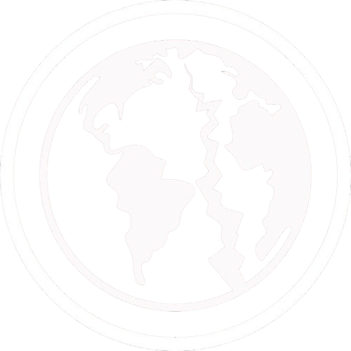

# בני קורח - SONS OF KORAH

ארגון בני קורח צובר תאוצה בשנה האחרונה בחסות הכאוס הפוליטי בסקטור דלתא.
תחת אצטלה פופוליסטית של צדקה ונדבנות, הארגון מגייס ומאמן צבא קנאים שמאיים על יציבות הצי.

{ align=left width="300" }

## אפיון

* **גודל הארגון:** גדול
* **עוינות כלפי הצי:** גבוהה ביותר
* **נאמנות פנימית:** בינונית
* **סודיות הארגון:** גבוהה
* **בעלי ברית:** פלגים קיצוניים בחזית

## מטרות הארגון

מתוך חומרי תעמולה שהופצו בידי הארגון ומדברי אסירים בחקירותיהם, כוונותיו המוצהרות של הארגון הן
החלפת שלטון הצי בסקטור דלתא בשלטון בהובלת מנהיגם המכונה ״סיני״ ושאר הנהגת בני קורח. חברי
הארגון המצויים במאסר בצי האנושי מתארים את סיני כמי שיגאל אותם ואת האנושות ויתווה את הדרך
אל האושר האמיתי.

לעומת זאת, מסמכים מסווגים שהגיעו לידי הצי מצביעים על אידאולוגיה אפלה ביותר, ובה הדים לרעיונות
קיצוניים כמו הכחדת האנושות בחלל. למשל, כרזה של הארגון שהופצה לפני כשנה (ומאז הוסרה ממרבית
המקומות הפומביים), מכילה את התפילה הבאה:

> The Sons shall thrive on the riches of the Sinners,  
> The Sinners shall burn in the flames of the Stars,  
> The Stars shall light the Mouth of the Earth,  
> The Mouth of the Earth shall swallow its Sons  

אין להמעיט בסכנה שאידאולוגיה פנאטית שכזו מהווה ליציבות הצי והברית המשולשת. 
בין אם מדובר במנהיג אופורטוניסט שמנצל את יכולתו להכפיף אליו את ההמונים למטרות הנאה וכוח,
ובין אם מדובר בפונדמנטליסט עם אידאולוגיה קיצונית, בני קורח מהווים סכנה ממשית.

הארגון פועל באופן עצמאי, אך קיימות חשדות שהוא משתף פעולה עם פלגים קיצוניים בחזית
הפטריוטית של טרה, שחולקים מאפיינים דומים של חשדנות כלפי הממסד. באופן רשמי
הארגון סולד מחוצנים.

## הנהגה ומבנה ארגוני

בראש הארגון עומדת אישיות מסתורית המכונה ״סיני״. מהמודיעין שאספנו, עולה שמנהיג
הארגון בה בעת משמש כמנהל הארגון ומהווה את הסמכות הרוחנית הבכירה בו. רק החברים
הנאמנים ביותר, שהוכיחו את מחויבותם ויכולת ההקרבה שלהם לטובת הארגון, זוכים לפגוש בו
ולראות את פניו. מול אלפי המאמינים הוא מופיע רק בקולו או בכיסוי פנים.

תחת אותו ״סיני״, קיימות שתי זרועות לארגון. שתיהן מהוות חלק מבני קורח ופעמים רבות הן
פועלות בשיתוף פעולה, אך כדי להבין את מבנה הארגון נקרא להן ״כנף הנדבנות״ ו״כנף הלוחמה״.

## פעילות פלילית - חתרנית

### כנף הנדבנות

כך התחיל הארגון להגיע לתודעה הציבורית: באמצעות חלוקת נדבות לנזקקים בתחנות ברחבי
הסקטור. כמעיין רובין-הוד, הארגון גנב מזון מספינות תובלה ומחסנים של הצי ושל גורמים פרטיים,
ואז חילק את השלל לתושבי הסקטור. תחילה היו אלה מצרכי מזון בסיסיים, אך בהמשך נגנבו גם
תרופות יקרות, פריטים טכנולוגיים ואפילו ספינות חלל קטנות.

הפעילות יצרה לבני קורח מוניטין טוב בקרב רבים מתושבי הסקטור. סביב דמויות בולטות מבני
קורח החלו להתקבץ פעילים שהובילו בעצמם פעולות דומות, ״והפיצו את הבשורה״.

אנו סבורים כי תפקידה המשני של כנף הנדבנות הוא גיוס פעילים לכנף השנייה של הארגון: 
כנף הלחימה.

### כנף הלחימה

הזרוע הצבאית של הארגון. ממצאינו מעידים על כך שהיא הולכת וגדלה בחודשים האחרונים,
ומבצעת יותר ויותר פעולות צבאיות במטרה לפגוע בתשתיות הצי ובספינות סיור. הנזק שנעשה
לצי עד כה בפגיעה ברכוש נאמד במאות אלפי אירידיום,וכן מתועדת פגיעה מרובה בנפש.

לאחרונה החלו פעילי זרוע הלחימה של בני קורח להקים תחנות אימונים מתקדמות באזורים
נסתרים בסקטור דלתא. חלק מהתחנות הללו הושמדו, אך המידע המודיעיני מצביע על הקמת
בסיסים נוספים וגדולים יותר.
