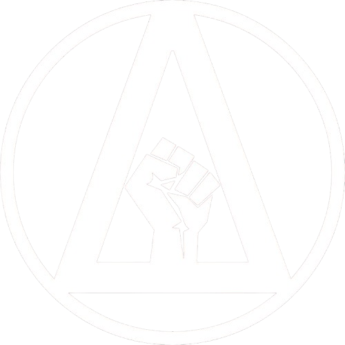

# הברית לשחרור דלתא - DLA

ארגון חדש שהוקם כתגובה להתגברות פעולות הטרור של ארגון בני קורח, ונאבק בהם באמצעות
פעולות חבלה והתנגדות מזוינת. שאיפתם המוצהרת :לשחרר את סקטור דלתא ולהשיב את
השלום והחופש לתושבים.

{ align=left width="300" }

## אפיון

* **גודל הארגון:** קטן
* **עוינות כלפי הצי:** נמוכה
* **נאמנות פנימית:** גבוהה
* **סודיות הארגון:** בינונית
* **בעלי ברית:** משת״פים רבים בתחנות צי

## מטרות הארגון

ארגון ״הברית לשחרור דלתא״ (Delta Liberation Alliance, בקיצור - DLA) הוקם בתחילת 
שנת 2800 על ידי חיילים משוחררים בצי האנושי ומספר שותפים כתגובה לעלייה בכוחו של
ארגון בני קורח, המשליט טרור בסקטור בשנים האחרונות. תחילה, הארגון תפקד כרשת
תמיכה לבני משפחות וחברים של נפגעי פעולות בני קורח. בהמשך, ה-DLA סיגל תפיסה
חדשה כמיליציה שפועלת נגד הארגון.

על פי פרסומיה ברשתות, הברית לשחרור דלתא פועלת כנגד בני קורח מפני ש״הצי
האנושי ושאר חברי הברית המשולשת הפקירו את הסקטור ולא עומדים במשימה הבסיסית
ביותר: הגנה על התושבים מפני איומים חיצוניים ופנימיים.״ ניסיונות הידברות של הנהגת הצי
בסקטור עם מנהיגי הארגון לא הניבו פירות עד כה, למרות שבבסיס מטרות הארגון הולמות
את מטרות הצי.

## הנהגה ומבנה ארגוני

בראש הארגון עמדו עד לאחרונה מייקל ג׳ונס וסימו רו. בחודש אוגוסט לשנת 2800 השניים
נחטפו על ידי בני קורח. במהלך מבצע של הצי ג'ונס נמצא ללא רוח חיים. ככל הנראה, רו
הצליחה לברוח מזרועות הארגון, אך אין מידע מהימן על מיקומה.

כיום, רו מובילה לבדה את הארגון (נכון לכתיבת שורות אלה, לא נמצא מחליף לג'ונס).
הארגון מורכב מסניפים בכל רחבי הסקטור. בראש כל סניף עומד מפקד הסניף, שאחראי
על פעילות הארגון באזורו, למשל איסוף מידע על בני קורח וחברי הארגון המקומיים, ריגול
בתוך הארגון, השגת כלי נשק ותחמושת, גיוס חברים חדשים וכו׳. חברי הארגון פועלים
תחת מפקדי הסניפים בתפקידים מנהליים, טכניים, ולוחמניים.

על פי המודיעין שאספנו, תפקיד ייחודי בחשיבותו בארגון הוא תפקידם של ה-״קשרים״: 
נציגים מכל סניף שתפקידם העברת מידע בחשאיות בין הסניפים מבלי להתגלות או
לחשוף את זהותם וקשרם לארגון.

## פעילות פלילית - חתרנית

הסכנה המרכזית שה-DLA מהווה נעוצה ביכולתו לבצע פעילות צבאית בלתי-מרוסנת
ובלתי-מבוקרת בתוך גבולות הצי. אמנם ל-DLA ולצי מטרה משותפת - השמדת בני קורח,
אך במקביל במהלך החודשים האחרונים התקיימו חיכוכים רבים עם הארגון, ביניהם:

* ריגול ופריצה למערכות המידע של הצי הנוגעות לבני קורח.
* פשיטות אלימות על מעוזי בני קורח הסמוכים לריכוזי אוכלוסין.
* גניבת נשק ממחסני הצי.
* הפצת תעמולה כנגד הצי ו״אוזלת ידו״ בטיפול בבני קורח.

לצד פעילותו הפלילית,הארגון מספק תמיכה לקורבנות בני קורח, אוסף מידע על חברים
בארגון הפשיעה, ומנסה להעניק למשפחות סיוע בהחזרת בניהם ובנותיהם שמוחם נשטף
בחזרה הביתה.
