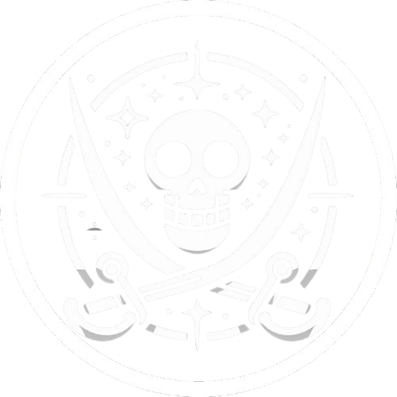

# נובו רזיסטנס - NOVO RESISTANCE

עם ראשית הגעת האנושות לסקטור דלתא ,הגיעו גם פיראטים ופורעי חוק . במהלך
מלחמות הברקאל רבים מהם התאגדו לקבוצת פושעים מאורגנת - נובו רזיסטנס, הפיראטים
הוותיקים בסקטור דלתא.

{ align=left width="300" }

## אפיון

* **גודל הארגון:** גדול מאוד
* **עוינות כלפי הצי:** גבוהה
* **נאמנות פנימית:** נמוכה
* **סודיות הארגון:** נמוכה
* **בעלי ברית:**  סטארלייט סיטי, קשרים עם הקונגלומרט

## מטרות הארגון

"נובו רזיסטנס" הוא ארגון הפיראטים הוותיק בסקטור דלתא ,המאגד עשרות-אלפי פיראטים
ברחבי הסקטור. מימיו הראשונים, לא הייתה לארגון מטרת-על אחידה או שאיפות פוליטיות
קוהרנטיות. ניתן לראות ביטוי לכך בשבועה שנשבעים חברי צוות ספינה שמצטרפים לרשת
הפיראטים:

> ״לא נכרע ברך, לא נציית לחוק, לא ניכנע.״

למרות היותו עוין לצי ,ארגון נובו רזיסטנס לא שואף לפרק את הצי אלא מתמקד בשימור
כוחו והשפעתו תוך כדי תקיפת ספינות צי ומתקנים אסטרטגיים. תאים רבים רואים בצי אויב
שאפשר להשתמש בו כפרטנר לעסקאות סמויות ,כמו הברחות נשק או שוחד קצינים, כל עוד
הדבר משרת את מטרותיהם .יש מי שמתארים את הארגון כטפיל של הצי האנושי: מחליש
אותו,אך זקוק לו כדי להמשיך להתקיים בצורתו הנוכחית.

בפני עצמו ,נובו רזיסטנס לא היווה מעולם איום משמעותי על יציבות הסקטור. עם זאת,
גורמים עוינים אחרים הפועלים בסקטור מנצלים את שירותיו לא פעם ,משום שפועלים בו
חברים רבים שאינם נאמנים לגוף כלשהו.

## הנהגה ומבנה ארגוני

המבנה הארגוני של הנובו רזיסטנס מבוזר לחלוטין. אין הנהגה מרכזית או גוף כלשהו
המפקח על כל פעילות הארגון, וכל תא פועל באופן עצמאי. כתוצאה מכך ,לעיתים מתגלעת
תחרות בין תאים שונים על משאבים או שטחי השפעה.

### תאים עצמאיים

כל תא בנובה רזיסטנס פועל עצמאית לחלוטין, כאשר לכל תא יש את מטרותיו, שיטות
הפעולה והמשאבים שלו. תאים אלה משתנים בגודלם ובהשפעתם, החל מקבוצות קטנות
של שתיים-שלוש ספינות ועד להתארגנויות גדולות של עשרות ספינות יחדיו.

### קפטנים

בראש כל תא עומד קפטן המשמש כמנהיג התא. הקפטן מקבל החלטות אסטרטגיות, 
מגייס חברים ומנהל את הקשר עם תאים אחרים במידת הצורך. הקפטנים יכולים להחזיק
בגישות שונות בנוגע ליחסם לצי ,לפלגים השונים ולמטרות שלהם. חלקם מתמקדים
בהברחות וסחר בעוד אחרים מובילים מתקפות ישירות על מתקני הצי או שיירות סחר.

### התאגדות מזדמנת (Ad-Hoc Alliances)

לעיתים תאים שונים מתאגדים כדי לבצע משימות גדולות יותר כמו מתקפה על תחנת
חלל גדולה או מארב לשיירות סחר וספינות צי .בריתות אלו הן זמניות ולרוב מתפרקות
עם סיום המשימה .הן יכולות להיווצר מתוך אינטרס משותף ,אך לעיתים גם מתוך צורך
הדדי כמו הגנה מאיום חיצוני או ניצול משאבים משותפים.

## פעילית פלילית - חתרנית

פעילות הנובו-רזיסטנס היא פעילות פיראטית טיפוסית לכל סקטור ברחבי הפדרציה.
פעולותיהם הפליליות של חברי הארגונים כוללים, אך לא מוגבלים ,לדברים הבאים:

* **הברחות נשק מתקדם וחומרים אסורים:** הפיראטים מבריחים כלי נשק מתקדמים
ומשוכללים וסחורות בלתי-חוקיות לטובת ארגוני פשיעה אחרים ופלגים צבאיים מורדים.
* **שוד ספינות סחר:** אחד העיסוקים העיקריים של נובו רזיסטנס הוא שוד שיירות סחר
בין-כוכביות. הם תוקפים ספינות מסחר ומשתלטים על המטענים, ואז מוכרים את תכולתם
בשוק השחור.
* **חטיפת אנשי צי למטרות כופר:** הפיראטים חוטפים קצינים או אנשי צוות בכירים בצי
האנושי ודורשים כופר גבוה או מידע אסטרטגי בתמורה לשחרורם. לעיתים,הם משתמשים
בחטופים כדי להשיג גישה למערכות מסווגות או מתקנים רגישים.
* **שירותי שכירי חרב:** חלק מהפיראטים בנובו רזיסטנס פועלים כשכירי חרב עבור ארגונים
אחרים .הם מספקים שירותי הגנה,⁠⁠⁠⁠⁠⁠⁠חבלה ,ואף חיסולים ממוקדים על פי דרישה.
