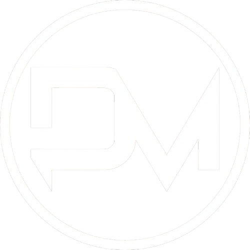

# דארק מאטר - DARK MATTER

ארגון "דארק מאטר" הוא אחד הארגונים הסודיים והמשפיעים ביותר בשביל החלב. פעולתו מתרכזת
בעיקר בסקטורים אלפא ודלתא ,ולמרות שאינו ארגון גדול זרועו מגיעה לכל קצוות הגלקסיה, שם הוא
מפעיל רשתות רחבות של סחר ופעילויות לא חוקיות.

{ align=left width="300" }

## אפיון

* **גודל הארגון:** בינוני
* **עוינות כלפי הצי:** נמוכה
* **נאמנות פנימית:** גבוהה ביותר
* **סודיות הארגון:** גבוהה ביותר
* **בעלי ברית:** אין בעלי ברית מוכרים

## מטרות הארגון

בשל הסודיות הגבוהה ,קשה לרדת לעומק מטרותיו של הארגון. לאחרונה התגלה על ידי צוותי הצי
שנשלחו למשימות ריגול אופן הפרנסה המרכזי של הארגון: סחר בסם הסטארדאסט. ייתכן שצבירת
הון מהסם היא מטרתו המרכזית של הארגון, אך אולי מטרות נוספות מסתתרות מתחת לפני השטח.

ככל הידוע לנו עד כה, בין המטרות הסמויות הללו לא נכללת מטרה של פגיעה בצי והוא לא מנהל
יחסים מיוחדים עם אף אחד מחלקי הברית המשולשת.

## הנהגה ומבנה ארגוני

### הברונים

הארגון נשלט על ידי מספר מנהיגים המכונים “ברונים” (Barons). מספרם המדויק לא ידוע לציבור
הרחב ,אך ההערכה העדכנית היא בין חמישה לעשרה ברונים מרכזיים.

הברונים משמשים כמנהיגי הארגון. לכל ברון תחום אחריות שונה, והם פועלים יחד בתיאום רב.
הברונים הם האנשים החזקים והמשפיעים ביותר בארגון, ויש להם את הסמכות המוחלטת על
כל פעולותיו. למרות התיאום הרב ביניהם, קיים חשד שקיימת גם תחרות ביניהם על מעמד
ויוקרה ביחס לשאר הברונים.

### סוכנים חשאיים - "עורבים" (Ravens)

הארגון מפעיל סוכנים חשאיים המכונים “עורבים”, שנחשבים לסוכנים המסוכנים ביותר בגלקסיה.
הם ידועים באופיים המאיים וביכולותיהם המתוחכמות להשיג את מה שהם רוצים מקורבנותיהם.
העורבים מומחים בהסוואה ובריגול ,ומבצעים משימות אסטרטגיות ומסוכנות ברחבי הגלקסיה, 
כשאיסוף מידע מהווה חלק מרכזי בפעילותם.

הצי הניח את ידיו על עורבים מעטים מאוד לאורך השנים ,וגם אלה לא הסגירו מידע על הארגון.
המידע שהצלחנו להשיג מעיד על כך שעורבים מדווחים ישירות לברונים, ונמצאים איתם בקשר
שוטף.

### שומרי סוד

העורבים פועלים בשיתוף פעולה עם "שומרי סוד" – פושעים שקיבלו סכומי כסף גדולים
והתחייבו לשמור על נאמנותם לארגון, עד כדי נכונות למות כדי לא לחשוף את פעולותיו.
לעתים קרובות עורב ישמש כקפטן של ספינה ואנשי הצוות שלו יוגדרו כשומרי סוד. במקרים
אחרים ,אנשי הצוות לא יהיו מודעים לזהותו האמיתית של הקפטן.

כל עורב נושא באחריות מלאה לשומרי הסוד שלו, ועליו להוכיח לברון שלו שיש בידיו מידע
אישי רגיש שלהם. הארגון ככלל מחזיק את שומרי הסוד תחת איום על קרוביהם ואהוביהם,
ובכך מבטיח את נאמנותם המוחלטת. שומרי הסוד הם חלק חשוב ממערך הביטחון והסודיות
של דארק מאטר.

## פעילות פלילית - חתרנית

כיום,ההערכה המקובלת ביותר היא שהארגון נשען כלכלית באופן נרחב ומשמעותי על סחר
בסם המכונה "סטארדאסט" (Stardust) - אבק כוכבים. מדובר בסם הקשה הנפוץ ביותר
בגלקסיה בעשרים השנים האחרונות.

רק לאחרונה התגלה כי מקורו של הסם מצמח ה-״אטריס״ (Atris) אך נסיונות הצי לחקות
את יצירת הסם במעבדה נחלו כישלון. ישנן השערות כי ברשות דארק מאטר טכניקות
ייחודיות או מרכיבים סודיים המאפשרים להם את הפקת הסם מהצמח.

הארגון מפיץ את הסם באמצעות רשת סבוכה של מפיצים, שמקשים על הגעה למקורות הייצור.
הסחר בסטארדאסט מסווה תחת שכבות של הטעיה והברחות של סחורות אחרות.
