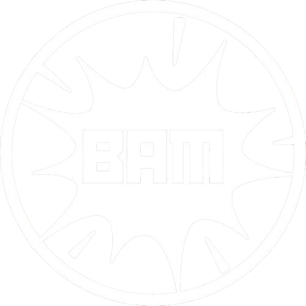

# ב.א.מ - BAM

שנים אחרי שאסון תחנה 404 ירד מסדר היום הציבורי, מיליציה אחת עדיין מקדישה את חייה
למאבק במי שהם חושבים שהוביל לאסון הנורא הזה. החשדות מתחלפים משנה לשנה, אך המניע
עדיין חי ובועט: נקמה.

{ align=left width="300" }

## אפיון

* **גודל הארגון:** קטן
* **עוינות כלפי הצי:** גבוהה
* **נאמנות פנימית:** גבוהה מאוד
* **סודיות הארגון:** בינונית
* **בעלי ברית:** חשד לשיתוף פעולה עם קונפדרצית א׳קי

## מטרות הארגון

ב.א.מ (BAM, ראשי תיבות: Broken Asteroid Militia) הוא ארגון צבאי קטן של לוחמי גרילה.
מטרתה המוצהרת של המיליציה היא הבאתם לדין של מי שאחראים לטענתם לחורבן תחנה
404. בארגון קיימת חשדנות רבה כלפי כל הממסד, הן של הצי האנושי, הן של החזית הפטריוטית 
של טרה ,והן של הקונגלומרט השמיימי.

במציאות הכאוטית שלאחר מלחמת הברקאל השלישית, נראה שהעויינות של ב.א.מ. עולה
מדרגה. המודיעין שלנו מצביע על שיתוף פעולה בין גורמים מסויימים בארגון לבין כוחות סיור של
קונפדרציית א׳קי.

## הנהגה ומבנה ארגוני

בראש הארגון עומדת קים סוג׳ין ,שסבלה מכוויות קשות במתקפה על תחנת 404 וניצלה בנס.
הארגון פועל כמו מיליציה לכל דבר, עם שרשרת פיקוד ברורה ונוקשה. להערכתנו ,הארגון מונה
כיום לא יותר מאלף חברים, המפוזרים ברחבי הסקטור ביחידות סגורות ודיסקרטיות.

כל יחידה מקבלת את פקודותיה מהמטה של קים, אשר מיקומה אינו ידוע בשל העובדה שהיא
מחליפה את מקומה לעיתים תכופות. כל יחידה כזו צמודה לחללית תובלה גדולה, שמסתווה לרוב
כמשלוח מזון או תרופות בין תחנות ,ובתוכה בפועל מסתתרים חומרי הנפץ העוצמתיים
המאפיינים את פעולות הארגון.

## פעילות פלילית - חתרנית

הארגון הוקם בשנת 2791כתגובה לחוסר שביעות רצון של צעירים רבים מארגוני הפליטים של
תחנה 404, שבעיניהם ,כדבריה של סוג׳ין במניפסט שפרסמה:

״… נכנעו לכספי ההשתקה    של הברית המשולשת והפסיקו לחפש את האמת מאחורי האסון הנורא״.

פעילות הארגון הוצאה מחוץ לחוק בשנת, 2797 לאחר שפעיליו התנקשו בשגריר החזית
הפטריוטית בסקטור דלתא. הארגון טען כי ההתנקשות היא תגובה על מעורבותו של
השגריר במתקפה על תחנה 404, ושיתוף הפעולה שלו עם הברקאל. אולם טענות אלה לא
הוכחו.

לאחר המתקפה, ירדו חברי מיליציית ב.א.מ .למחתרת. בשנים האחרונות, חברי הארגון פועלים
כארגון פיראטי ,ולוקחים חלק בפעלות פליליות רבות, ביניהן סחר בסחורות אסורות, חטיפות
ועוד. חברי ב.א.מ. נחשבים למומחים בייצור חומרי נפץ עוצמתיים מאד,ועל כן קיימת במסגרת
המיליציה גם פעילות ענפה של סחר בחומרי נפץ ,המרוויחה לארגון הון לא קטן.
